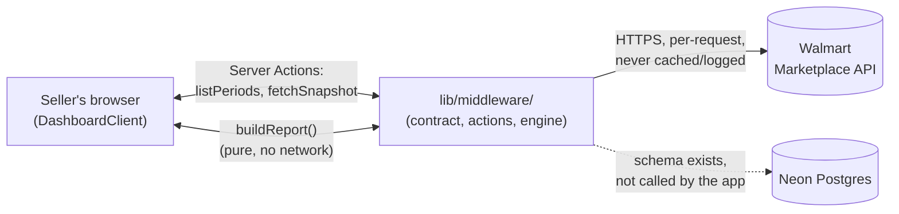

# byRaf Distribution Tools — Documentation Index

This is the central map of the repository: what it is, how it's put together, and where to find the detail on any specific system, component, or file. Start here, then drill into whichever page below matches what you're trying to understand or change.

**Read this alongside — not instead of — the existing docs it links to.** `docs/multi-marketplace-plan.md`, `docs/adding-a-marketplace.md`, `docs/walmart-api-notes.md`, and `walmart-margin-tracker-plan.md` (repo root) are the project's own design/decision records and remain the canonical source for *why* things are the way they are. The pages under `docs/systems/` (linked below) are new: they index the same codebase by system/component/file, with diagrams, so both a human and an AI coding agent can navigate straight to an implementation without re-reading every design doc first.

## What this repository is, in one paragraph

**byRaf Distribution Tools** is a Next.js 16 (App Router) application. Its one shipped product is the **Margins Dashboard**: a multi-marketplace seller profit/margin tracker. A seller pastes API credentials for one or more marketplaces (Walmart today; a fixture-backed "Demo" source for development and testing), picks which settlement periods to load, and sees revenue, fees, profit, inventory, and stock value — per order line and rolled up per product — once they've entered what each product actually cost them. The app is **stateless in production**: no login, no database use, nothing persisted beyond one `localStorage` flag for a dismissed install banner. A Postgres/Drizzle schema and Neon database are provisioned for a planned persisted version but are not used by the running app.

## Start here

| If you want to... | Go to |
|---|---|
| Understand the whole system at a glance, with the main architecture diagram | [Architecture Overview](./systems/architecture.md) |
| See exactly what the dashboard sees vs. what only the middleware/connectors see | [Middleware Contract](./systems/middleware-contract.md) |
| Understand how margin/profit/stock-value/price figures are actually calculated | [Engine](./systems/engine.md) |
| Understand how Walmart (or a future marketplace) integration works | [Connectors](./systems/connectors.md) + [`docs/adding-a-marketplace.md`](./adding-a-marketplace.md) |
| Understand the UI: tabs, wizard flow, mobile/PWA behavior, state | [Frontend / Dashboard](./systems/frontend.md) |
| Understand the (unused) database schema and why it exists | [Data Model](./systems/data-model.md) |
| Understand env vars, the import-boundary rule, and the security model | [Configuration & Security](./systems/configuration-and-security.md) |
| Know what's tested, how, and how deploys happen | [Testing & Deployment](./systems/testing-and-deployment.md) |
| Read the user-facing product description | [`README.md`](../README.md) |
| Read the original design/decision history | [`walmart-margin-tracker-plan.md`](../walmart-margin-tracker-plan.md) (root), [`multi-marketplace-plan.md`](./multi-marketplace-plan.md), [`walmart-api-notes.md`](./walmart-api-notes.md) |

## Repository → Systems → Components → Files

```mermaid
flowchart TB
    Repo["byRaf Distribution Tools"]

    Repo --> Frontend["Frontend / Dashboard\napp/(dashboard)/dashboard/"]
    Repo --> Middleware["Middleware Contract\nlib/middleware/contract/, actions.ts, index.ts"]
    Repo --> Engine["Engine (pure math)\nlib/middleware/engine/"]
    Repo --> Connectors["Connectors\nlib/middleware/connectors/"]
    Repo --> DataModel["Data Model (unused)\nlib/db/, drizzle/"]
    Repo --> Config["Configuration & Security\nnext.config.ts, eslint.config.mjs, .env.example"]
    Repo --> Testing["Testing & Deployment\nscripts/, package.json, Vercel"]

    Frontend --> FE1["DashboardClient.tsx — state & wiring"]
    Frontend --> FE2["components/tabs/* — one per report view"]
    Frontend --> FE3["components/* + shared/* — tables, cards"]
    Frontend --> FE4["PriceChart.tsx — hand-built SVG chart"]
    Frontend --> FE5["InstallPrompt.tsx — PWA banner"]

    Middleware --> M1["contract/index.ts — SourceDescriptor, Snapshot, Report, ..."]
    Middleware --> M2["actions.ts — describeSources, listPeriods, fetchSnapshot"]
    Middleware --> M3["index.ts — buildReport, parseCostCsv, exportCsv"]

    Engine --> E1["margins.ts — computeMargins, stockValue, reconcileStock"]
    Engine --> E2["identity.ts — SKU aliasing, duplicate detection"]
    Engine --> E3["prices.ts — priceSeriesBySku"]
    Engine --> E4["csv.ts — export/import + formula-injection guard"]
    Engine --> E5["report.ts — buildReport pipeline"]

    Connectors --> C1["base.ts — MarketplaceConnector abstract class"]
    Connectors --> C2["registry.ts — CONNECTORS[]"]
    Connectors --> C3["walmart/ — real API integration"]
    Connectors --> C4["demo/ — fixture-backed reference"]

    DataModel --> D1["schema.ts — walmart_recon_rows, sku_costs, sync_runs"]
    DataModel --> D2["index.ts — getDb() lazy Neon client"]
```

## The one rule that shapes almost everything

> **The dashboard never talks to a marketplace directly.** It talks only to `lib/middleware`. The middleware owns every marketplace connection, all normalization, and all of the math, and hands the dashboard finished, display-ready figures.

This is enforced by three independent mechanisms (ESLint import rule, `server-only` imports, and a text-scanning script) — see [Configuration & Security — the middleware import boundary](./systems/configuration-and-security.md#the-middleware-import-boundary) — and is the reason the codebase splits cleanly into the systems listed above. Full rationale: [`multi-marketplace-plan.md`](./multi-marketplace-plan.md).

## High-level architecture (see [Architecture Overview](./systems/architecture.md) for the full diagram and deployment view)

## Documentation map

### System documentation (`docs/systems/`)

| Page | Covers |
|---|---|
| [Architecture Overview](./systems/architecture.md) | Layered architecture, request-flow sequence diagram, deployment diagram, full directory map |
| [Middleware Contract](./systems/middleware-contract.md) | Every type crossing the dashboard/middleware boundary (`SourceDescriptor`, `Snapshot`, `Report`, `CostInputs`, ...), the three server actions, `buildReport` |
| [Engine](./systems/engine.md) | Margin calculation, cost/stock model, SKU identity & aliasing, price-over-time series, CSV shapes and formula-injection guard |
| [Connectors](./systems/connectors.md) | `MarketplaceConnector` base class, the registry pattern, the Walmart connector's real API quirks, the Demo fixture connector, known gaps |
| [Frontend / Dashboard](./systems/frontend.md) | Component tree, wizard state machine, the six report tabs, price chart internals, PWA install prompt |
| [Data Model](./systems/data-model.md) | The provisioned-but-unused Drizzle/Neon schema, why it exists, what would need to change to revive it |
| [Configuration & Security](./systems/configuration-and-security.md) | Environment variables, the import-boundary enforcement, the full stateless security model |
| [Testing & Deployment](./systems/testing-and-deployment.md) | npm scripts, what each test script verifies, build, and the Vercel auto-deploy pipeline (no CI configured) |

### Existing project documentation (pre-existing, canonical for design rationale)

| Page | Covers |
|---|---|
| [`README.md`](../README.md) | User-facing product description: how the dashboard works, every tab, mobile/PWA behavior, privacy/security model, known limitations |
| [`walmart-margin-tracker-plan.md`](../walmart-margin-tracker-plan.md) | The original V1 plan (persisted architecture) plus a "Current Build" section recording what's actually live vs. deferred |
| [`multi-marketplace-plan.md`](./multi-marketplace-plan.md) | The middleware/connector split: goals, contract sketch, phases, decisions |
| [`adding-a-marketplace.md`](./adding-a-marketplace.md) | Step-by-step checklist for implementing a new connector |
| [`walmart-api-notes.md`](./walmart-api-notes.md) | Verified Walmart Marketplace API behavior, field meanings, and every pagination/quirk gotcha found by testing against a live account |

## Answering common questions (a map for AI agents and new contributors)

| Question | Where to look |
|---|---|
| Where is profit/margin actually computed? | [Engine — `computeMargins`](./systems/engine.md#computemargins-per-line-profit) |
| Where does order/fee data come from? | [Connectors — the Walmart connector](./systems/connectors.md#the-walmart-connector) |
| What happens when the dashboard calls `fetchSnapshot`? | [Architecture — request flow sequence diagram](./systems/architecture.md#request-flow-connecting-listing-periods-loading-data-editing-a-cost) |
| What data is stored, and where? | [Data Model](./systems/data-model.md) — short answer: nothing, in production |
| What services/marketplaces does this depend on? | [Connectors](./systems/connectors.md) (Walmart today; Amazon/eBay planned, not built) |
| What config does a feature need? | [Configuration & Security — environment variables](./systems/configuration-and-security.md#environment-variables) |
| What tests cover a given area? | [Testing & Deployment](./systems/testing-and-deployment.md#what-each-test-script-actually-verifies) |
| What could break if I change `engine/margins.ts`? | [Engine](./systems/engine.md) (consumed by `report.ts`, re-exported through `lib/middleware/index.ts` into every dashboard tab) — run `npm run test:engine` |
| What could break if I change something under `app/`? | [Configuration & Security — the middleware import boundary](./systems/configuration-and-security.md#the-middleware-import-boundary) — run `npm run check:boundary` and `npm run lint` |
| How do I add a new marketplace? | [`adding-a-marketplace.md`](./adding-a-marketplace.md), backed by [Connectors](./systems/connectors.md) |
| Why does a Postgres schema exist if the app doesn't use it? | [Data Model — status](./systems/data-model.md#status-provisioned-but-not-read-or-written-by-the-running-app) |
| How does a deploy actually happen? | [Testing & Deployment — deployment](./systems/testing-and-deployment.md#deployment) |

## Known gaps, deprecated paths, and things worth flagging

- **`app/(dashboard)/margins/page.tsx`** and **`app/page.tsx`** are redirect-only legacy routes (to `/dashboard`), kept for old links/bookmarks — not active UI. See [Frontend — legacy route](./systems/frontend.md#legacy-route).
- **WFS storage fees would silently vanish today** if WFS activity appeared on a Walmart account, because `groupReconRows` drops rows with no Purchase Order #. Tracked explicitly, not yet hit in practice. See [Connectors — known gaps](./systems/connectors.md#known-gaps-and-unverified-behavior).
- **The `sku_costs` table's shape doesn't match the live cost model** (single cost vs. purchase-batch lots) — reviving persistence needs a new lots table, not a straight revival of the existing schema. See [Data Model — `sku_costs`](./systems/data-model.md#sku_costs--effective-dated).
- **No test framework or CI is configured** — verification is manual, via `tsx` scripts and `npm run lint`/`build`. See [Testing & Deployment](./systems/testing-and-deployment.md).
- **Several Walmart API behaviors are explicitly marked unverified** in [`walmart-api-notes.md`](./walmart-api-notes.md#still-unverified) (refund rows, WFS fee types, the Orders API cursor form for >1 page, `chargeAmount` for qty > 1) — treat any code depending on these as provisional.
