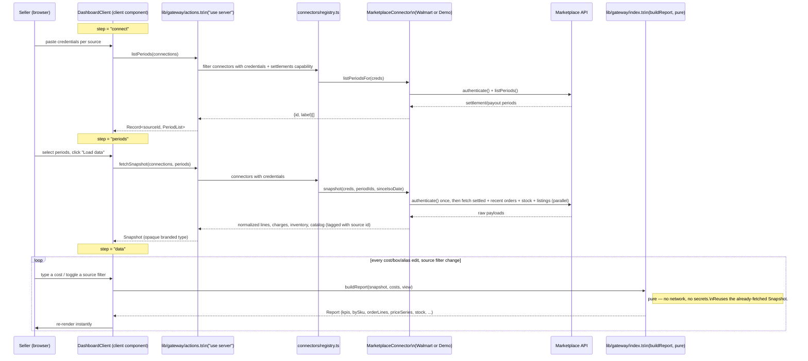
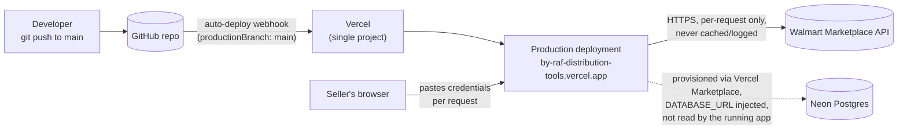

# Architecture Overview

> [Documentation Index](../index.md) · Related: [Gateway Contract](./gateway-contract.md) · [Engine](./engine.md) · [Connectors](./connectors.md) · [Frontend](./frontend.md) · [Configuration & Security](./configuration-and-security.md)

## What this repository is

byRaf Distribution Tools is a single Next.js application, currently shipping one product: **the Margins Dashboard**, a multi-marketplace seller profit/margin tracker. A seller pastes API credentials for one or more marketplaces (Walmart today; a fixture-backed "Demo" source for development), the app pulls sales, fees, inventory and catalog data, and shows true profit and margin once the seller enters what they paid for each product.

The repository is **stateless in production**: no database use, and sign-in is optional (off unless Clerk keys are set; see [Authentication](./authentication.md)). A Postgres schema and Neon database are provisioned for a planned persisted version, but the running app does not read or write them (see [Data Model](./data-model.md)).

The one architectural rule that shapes almost every file in `lib/` and `app/` is:

> **The dashboard never talks to a marketplace directly. It talks only to a gateway layer**, which owns every marketplace connection, all normalization, and all of the math. See [Gateway Contract](./gateway-contract.md).

This is documented at length in [`docs/multi-marketplace-plan.md`](../multi-marketplace-plan.md), the canonical design doc for this split; this page and its siblings under `docs/systems/` restate and cross-reference it as navigable, implementation-linked documentation.

## Layered architecture

```mermaid
flowchart TB
    subgraph Browser["Browser (client component)"]
        DC["DashboardClient.tsx\n(state: connections, costs, snapshot, view)"]
    end

    subgraph AppRouter["app/ — Next.js App Router (dashboard shell)"]
        Page["app/(dashboard)/dashboard/page.tsx\n(server component)"]
        Layout["app/(dashboard)/layout.tsx\napp/layout.tsx"]
        Legacy["app/(dashboard)/margins/page.tsx\n(redirect only)"]
        Root["app/page.tsx\n(redirect to /dashboard)"]
    end

    subgraph Gateway["lib/gateway/ — the only thing app/ may import"]
        Contract["contract/\nSourceDescriptor, Snapshot, Report, ..."]
        Actions["actions.ts (\"use server\")\ndescribeSources, listPeriods, fetchSnapshot"]
        Index["index.ts (client-safe)\nbuildReport, parseCostCsv, exportCsv"]
        Engine["engine/\nmargins, prices, identity, csv, report, types"]
        Registry["connectors/registry.ts"]
        Base["connectors/base.ts\nMarketplaceConnector"]
        Walmart["connectors/walmart/"]
        Demo["connectors/demo/"]
    end

    subgraph External["External systems"]
        WalmartAPI[("Walmart Marketplace API")]
        NeonDB[("Neon Postgres\n(provisioned, unused by the app)")]
    end

    DC -- "calls (server actions)" --> Actions
    DC -- "calls (pure function)" --> Index
    Page --> DC
    Page -- "describeSources()" --> Actions

    Actions --> Registry
    Registry --> Base
    Base --> Walmart
    Base --> Demo
    Walmart -- HTTPS --> WalmartAPI
    Actions --> Contract
    Index --> Engine
    Index --> Contract

    Layout --> Page
    Root -.-> Page
    Legacy -.-> Page

    Engine -.->|"drizzle schema exists but\nis not imported by any of this"| NeonDB

    style NeonDB fill:#eee,stroke:#999,color:#666
    style Engine fill:#e8f0ff
    style Contract fill:#e8f0ff
    style Actions fill:#e8f0ff
```

**Reading the diagram:** everything in the `Gateway` box lives under `lib/gateway/`. Code under `app/` is allowed to import only `lib/gateway` (the public `index.ts`) and `lib/gateway/actions`; this is enforced by an ESLint rule and a custom script — see [Configuration & Security](./configuration-and-security.md#the-gateway-import-boundary). No file under `app/` may import a connector or `engine/*` directly, and no file under `app/` may mention a marketplace name.

## The two-layer split, restated

| Layer | Lives at | Knows about | Does not know about |
|---|---|---|---|
| **Dashboard (frontend)** | `app/(dashboard)/dashboard/` | Forms, tables, tabs, the price chart, what the user typed (credentials, costs, box cost) | Marketplace names, fee vocabulary, HTTP, credentials' meaning |
| **Gateway contract + actions** | `lib/gateway/contract/`, `lib/gateway/actions.ts` | Every connected source, the shape of a `Report`, orchestrating connectors | The dashboard's rendering, browser-side state |
| **Engine (pure math)** | `lib/gateway/engine/` | Margin calculation, stock pooling, CSV shape, SKU identity/aliasing, price trends | Network, credentials, marketplace-specific field names |
| **Connectors** | `lib/gateway/connectors/` | One marketplace's real API (auth, pagination, field names, quirks) | The dashboard, the engine's internals, other connectors |

See [Gateway Contract](./gateway-contract.md) for the full type contract and [Engine](./engine.md) / [Connectors](./connectors.md) for what's inside the last two rows.

## Request flow: connecting, listing periods, loading data, editing a cost

This is the sequence a user actually walks through in the dashboard (`DashboardClient.tsx`), and which calls cross the gateway boundary.



Two things this diagram makes concrete:

1. **Credentials cross the boundary exactly twice** — `listPeriods` and `fetchSnapshot` — and never again. Every subsequent cost edit calls `buildReport`, which takes no credentials and makes no network call.
2. **The `Snapshot` is opaque to the dashboard.** `DashboardClient` stores whatever `fetchSnapshot` returns and hands it back to `buildReport` on every render, but (by TypeScript brand, not runtime enforcement) never reads a field from it. See [Gateway Contract](./gateway-contract.md#the-snapshot-brand).

## Deployment



- **One Vercel project**, no separate backend host — see the "Stack Decisions" section of [`walmart-margin-tracker-plan.md`](../../walmart-margin-tracker-plan.md) for why (originally planned as FastAPI + separate Next.js frontend, collapsed into one Next.js App Router project).
- **Every push to `main` deploys to production automatically.** There is no `vercel.json` and no CI workflow in this repository (no `.github/workflows/`) — `npm run lint`, `npm run test:*` and `npm run check:boundary` are run manually or by whoever pushes; see [Testing & Deployment](./testing-and-deployment.md).
- **Sign-in is env-driven.** Vercel Authentication was enabled once (2026-09-23) and explicitly turned back off (2026-09-24, per the plan doc). Login is now provided by the app itself through `lib/auth` (Clerk today) when its keys are set, on any host; with no keys, the pasted API key is the access control. See [Authentication](./authentication.md).

## Directory map

```
app/                              Next.js App Router — the dashboard shell only
  layout.tsx, manifest.ts         root HTML shell (reads the theme cookie), PWA manifest
  page.tsx                        redirects "/" -> "/dashboard"
  (dashboard)/
    layout.tsx                    app shell (menu bar with design toggle + Receipts, card frame)
    dashboard/                    the actual product
      page.tsx                    server component: calls describeSources(), renders DashboardClient
      DashboardClient.tsx         client component: all wizard/report state
      PriceChart.tsx               hand-built SVG line chart (no chart library)
      InstallPrompt.tsx            PWA "Add to Home Screen" banner
      types.ts, hooks/, utils/     shared frontend-only types and helpers
      components/                 tables, cards, tabs — see docs/systems/frontend.md
    receipts/                      stateless PDF Receipts folder — see docs/systems/frontend.md
    margins/page.tsx               legacy route, redirects -> "/dashboard"
components/
  ui/                              design kit + retro/modern theme switch (Button, Card, ..., styles.ts) — see docs/systems/frontend.md
lib/
  gateway/                     see docs/systems/gateway-contract.md
    contract/                     public types (SourceDescriptor, Snapshot, Report, ...)
    actions.ts                    "use server": describeSources, listPeriods, fetchSnapshot
    index.ts                      client-safe: buildReport, parseCostCsv, exportCsv, re-exported types
    engine/                       pure math — see docs/systems/engine.md
    connectors/                   marketplace integrations — see docs/systems/connectors.md
  auth/                            provider-neutral sign-in (Clerk adapter) — see docs/systems/authentication.md
  db/                              Drizzle schema + lazy Neon client — see docs/systems/data-model.md
proxy.ts                           Next 16 proxy (ex-middleware): the auth check before every page
drizzle/                           SQL migration + snapshot metadata for lib/db/schema.ts
docs/                              this documentation, plus the pre-existing design docs it links to
  multi-marketplace-plan.md        canonical design doc for the gateway split (phases, decisions)
  adding-a-marketplace.md          checklist for adding a connector
  walmart-api-notes.md             verified Walmart API behavior and gotchas
scripts/                           connectivity + fixture-regression scripts (see docs/systems/testing-and-deployment.md)
walmart-margin-tracker-plan.md     the original V1 plan; records what shipped vs. what's still on the roadmap
```

## Where to go next

- **How the dashboard and marketplaces are decoupled, and every type crossing that boundary:** [Gateway Contract](./gateway-contract.md)
- **The math: margins, estimation, stock pooling, SKU identity, CSV import/export:** [Engine](./engine.md)
- **How a marketplace becomes a connector, and everything Walmart's API actually does:** [Connectors](./connectors.md)
- **The dashboard's component tree, wizard steps, and mobile/PWA behavior:** [Frontend](./frontend.md)
- **The unused Neon/Drizzle schema and why it exists:** [Data Model](./data-model.md)
- **Optional sign-in, its env vars, and how to swap providers:** [Authentication](./authentication.md)
- **Environment variables, the ESLint import boundary, and the security model:** [Configuration & Security](./configuration-and-security.md)
- **npm scripts, the (nonexistent) CI, and how deploys happen:** [Testing & Deployment](./testing-and-deployment.md)
