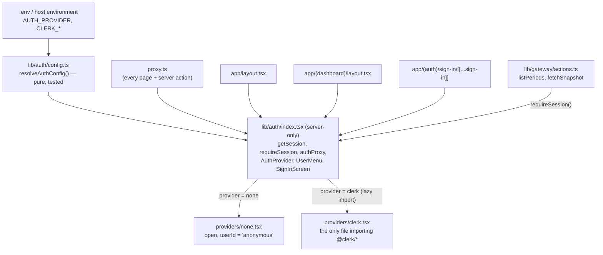

# Authentication

> [Documentation Index](../index.md) · Up: [Architecture Overview](./architecture.md) · Related: [Configuration & Security](./configuration-and-security.md) · [Data Model](./data-model.md)

## Overview

Sign-in is **optional and configured only by environment variables.** With no auth variables set, the app behaves exactly as it always has: open, with the pasted marketplace key as the only access control. Add a provider's keys to the environment and the whole app sits behind a sign-in screen. No code changes are needed.

Clerk is the first provider. The app never imports Clerk directly. It talks to a small provider-neutral module, `lib/auth`, and each provider is one adapter file behind it. That is what makes the provider swappable and the deployment host irrelevant.

This is the first step toward a stateful app: every request now has a stable `userId` (see [Toward saved data](#toward-saved-data)).

## Turning it on

1. Create an application at [dashboard.clerk.com](https://dashboard.clerk.com) and copy its two keys from **API keys**.
2. Put them in the environment, wherever your host keeps it:

   ```bash
   AUTH_PROVIDER=clerk                 # optional, see below
   CLERK_PUBLISHABLE_KEY=pk_test_...
   CLERK_SECRET_KEY=sk_test_...
   ```

3. Restart the app. Every page now redirects to `/sign-in` until the user signs in.

**Who can sign up** is set in Clerk, not here: **Dashboard → Configure → Restrictions** (allowlist, or "Restricted" mode to invite users only). For a single-seller deployment, turn sign-ups off after creating your own account.

### Variables

| Variable | Values | Notes |
|---|---|---|
| `AUTH_PROVIDER` | `clerk`, `none`, or unset | Unset: Clerk is on if any Clerk key is set, otherwise auth is off. Setting it makes intent explicit: `clerk` with missing keys is an error, and `none` silences the production "app is open" warning. |
| `CLERK_PUBLISHABLE_KEY` | `pk_test_…` / `pk_live_…` | `NEXT_PUBLIC_CLERK_PUBLISHABLE_KEY` is also accepted, since that's the name Clerk's docs and its Vercel integration use. |
| `CLERK_SECRET_KEY` | `sk_test_…` / `sk_live_…` | Server-only. Never passed to the browser or put in a resolved config object. |

### Fails closed

A mistake in these variables never quietly leaves the app open. `resolveAuthConfig` in [`lib/auth/config.ts`](../../lib/auth/config.ts) throws, and every page and server action then returns a 500 with the reason in the server log, when:

- only one of the two Clerk keys is set
- `AUTH_PROVIDER=clerk` is set without keys
- `AUTH_PROVIDER` names an unknown provider
- a key doesn't have its `pk_`/`sk_` prefix, or the two keys are swapped
- one key is `test` and the other is `live`

All of these are covered by `npm run test:auth`.

## Works on any host

Auth settings are read from `process.env` **at request time**, never at build time. That matters because Next.js freezes `NEXT_PUBLIC_*` variables into the JavaScript bundle during `next build`. So:

- One build, or one Docker image, can be promoted across environments with different keys.
- The publishable key reaches the browser as a prop from the server, not through the bundle.
- `AuthProvider`, `UserMenu` and `SignInScreen` call `connection()` before reading the env, which keeps every page dynamically rendered (`ƒ` in the build output).

The variables go wherever your platform keeps environment variables:

| Platform | Where |
|---|---|
| **Local / any Linux box** | `.env.local` (or `.env.production.local`) in the project root. `next dev` and `next start` load it automatically. A systemd unit can use `EnvironmentFile=`. |
| **Docker** | `docker run --env-file .env ...`, or `env_file:` in Compose. Don't bake keys into the image. |
| **Vercel** | Project → Settings → Environment Variables, or `vercel env add`. The Clerk Vercel Marketplace integration sets `NEXT_PUBLIC_CLERK_PUBLISHABLE_KEY` and `CLERK_SECRET_KEY`, which both work as-is. |
| **AWS** | Amplify: App settings → Environment variables. ECS/App Runner: the task or service environment, with `CLERK_SECRET_KEY` from Secrets Manager or SSM Parameter Store. |
| **Google Cloud Run** | `gcloud run deploy --set-env-vars CLERK_PUBLISHABLE_KEY=...`, and `--set-secrets CLERK_SECRET_KEY=clerk-secret:latest` from Secret Manager. |
| **Anything else** | Anything that sets process environment variables before `next start`. |

**Production keys** (`pk_live_`/`sk_live_`) only work on the domain registered with that Clerk instance: Clerk Dashboard → Domains, plus the DNS records it lists. Development keys work on `localhost` and any URL.

## How it fits together



| File | Role |
|---|---|
| [`lib/auth/config.ts`](../../lib/auth/config.ts) | Decides the provider from env. Pure, so a script can test it. |
| [`lib/auth/types.ts`](../../lib/auth/types.ts) | `AuthAdapter`, the contract a provider implements, and `AuthSession`. |
| [`lib/auth/index.tsx`](../../lib/auth/index.tsx) | The public surface. Loads the adapter once per server process, lazily. |
| [`lib/auth/providers/clerk.tsx`](../../lib/auth/providers/clerk.tsx) | Clerk: `clerkMiddleware`, `ClerkProvider`, `<UserButton>`, `<SignIn>`. |
| [`lib/auth/providers/none.tsx`](../../lib/auth/providers/none.tsx) | Auth off. `/sign-in` redirects to the dashboard. |
| [`proxy.ts`](../../proxy.ts) | Next 16's renamed `middleware.ts`. Skips static files so icons and the PWA manifest load signed-out. |

### Two layers of protection

1. **`proxy.ts`** redirects signed-out page requests to `/sign-in` (`/sign-in` itself is public).
2. **`requireSession()`** at the top of `listPeriods` and `fetchSnapshot`. Server actions are public POST endpoints that can be called on *any* route, including the public `/sign-in`, so the proxy alone isn't a guarantee. If the proxy were ever bypassed or misconfigured, these calls throw instead of running. `describeSources` is left open: it returns only the static list of supported sources.

Both layers were checked against a production build with Clerk keys: a signed-out `GET /dashboard` redirects to sign-in, a signed-out server action never runs, and with the proxy deliberately replaced by a pass-through, the action still fails rather than returning data.

### Boundaries (lint-enforced)

[`eslint.config.mjs`](../../eslint.config.mjs) enforces two rules:

- **Only `lib/auth/providers/` may import `@clerk/*`** (or any future provider SDK added to that rule).
- **`app/` may import `@/lib/auth` only**, never `@/lib/auth/*`.

## Adding another provider

Auth0, Cognito, Supabase Auth, Auth.js and others all follow the same steps:

1. Add the id to `AUTH_PROVIDERS` in `config.ts`, plus a branch in `resolveAuthConfig` that reads and validates its env vars. Fail closed.
2. Write `lib/auth/providers/<id>.tsx` that returns an `AuthAdapter`: `proxy`, `getSession`, `Provider`, `UserMenu`, `SignIn`.
3. Add a `case` in `loadAdapter()` in `index.tsx` that lazily imports it.
4. Add its SDK's package scope to the `no-restricted-imports` patterns in `eslint.config.mjs`.
5. Add env cases to `scripts/test-auth.ts`.

Nothing under `app/` or `lib/gateway/` changes.

## Toward saved data

`getSession()` returns `{ provider, userId }`. When persistence is built (see [Data Model](./data-model.md)), saved rows key off that `userId`, and a server action reads it with `const { userId } = await requireSession()`. The [`PortableData`](./engine.md#portable-save-file-engineportable) shape from import/export is the natural payload to save.

With auth off, `userId` is always `"anonymous"`, so every visitor would share one record. Persistence code should refuse to save, or be single-user by design, when `session.provider === "none"`.

## Not covered yet

- **Roles and organizations.** Every signed-in user sees the same app. Clerk supports both, and `AuthSession` can grow a `roles` field when it's needed.
- **Theming.** Clerk's sign-in card uses its default look, not the Mac System 1 styling. Clerk's `appearance` prop on `ClerkProvider` and `<SignIn>` controls this.
- **Marketplace credentials** are still pasted per session. Signing in doesn't save them.
