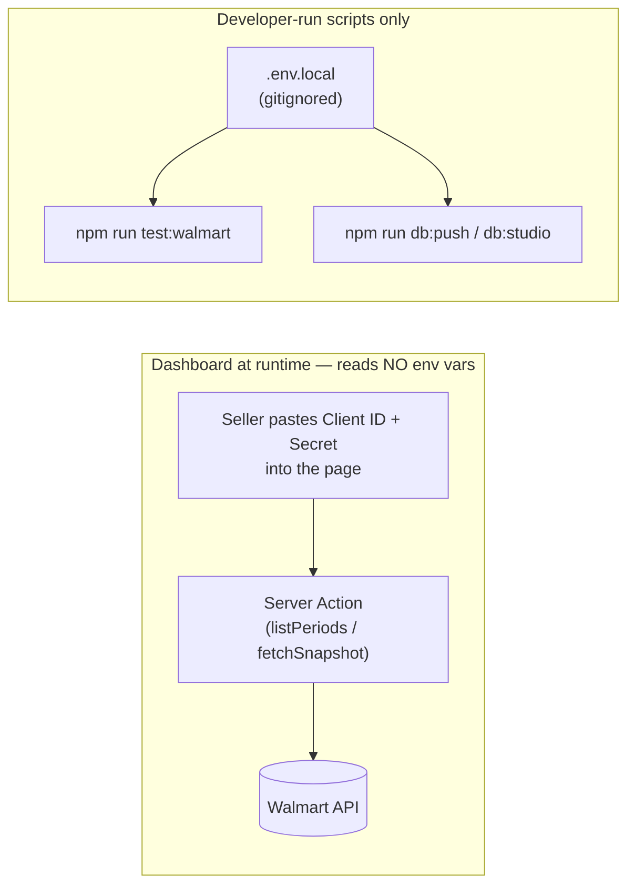
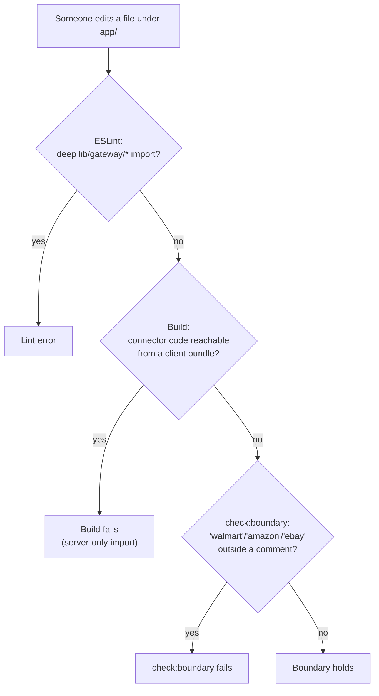

# Configuration, Environment & Security

> [Documentation Index](../index.md) · Up: [Architecture Overview](./architecture.md) · Related: [Data Model](./data-model.md) · [Testing & Deployment](./testing-and-deployment.md)

## Overview

This app's security model is unusually simple to state, because almost everything security-relevant reduces to one design decision recorded in the README: **nothing is stored.** No database is used by the running app (see [Data Model](./data-model.md)); credentials and every fetched figure live only in the browser tab and the single server request that needed them. This page documents every environment variable, every configuration file with security or correctness implications, and the specific guarantees (and their limits) that follow from the stateless design.

## Environment variables

| Variable | Required for | Read by | Notes |
|---|---|---|---|
| `WALMART_CLIENT_ID` / `WALMART_CLIENT_SECRET` | `npm run test:walmart` only | `getWalmartToken()` in [`connectors/walmart/auth.ts`](../../lib/gateway/connectors/walmart/auth.ts) | **The running dashboard never reads these.** Sellers paste their own Client ID/Secret into the browser form; only the connectivity-check script uses env-var credentials. |
| `DATABASE_URL` | `npm run db:push` / `db:studio` only | `lib/db/index.ts`'s `getDb()`, `drizzle.config.ts` | Injected automatically by the Vercel Neon integration. **Not read by any code path the running app exercises** — see [Data Model](./data-model.md). |

Copy [`.env.example`](../../.env.example) to `.env.local` to run any script locally; `.env.local` is gitignored and must never be committed. **No configuration is needed to run the dashboard itself** — `npm run dev` works with zero environment variables set, because credentials are pasted into the page at runtime, not read from the environment.



## The gateway import boundary

`app/` may import **only** `@/lib/gateway` (the public `index.ts`) and `@/lib/gateway/actions` — never a connector, never `engine/*` directly, never `contract/` directly. This is the mechanism that keeps the dashboard marketplace-neutral (see [Architecture Overview](./architecture.md) and [Frontend](./frontend.md)). It's enforced three separate ways, each catching something the others might miss:

1. **ESLint `no-restricted-imports`** ([`eslint.config.mjs`](../../eslint.config.mjs)), scoped to `files: ["app/**/*.{ts,tsx}"]`:
   ```js
   patterns: [{ group: ["@/lib/gateway/*/**", "!@/lib/gateway/actions"], message: "app/ may only import '@/lib/gateway' and '@/lib/gateway/actions' ..." }]
   ```
   Catches any deep import path at lint time.
2. **`import "server-only";`** at the top of every connector file (and any gateway file not also exercised by a `scripts/test-*.ts` script). This is a build-time guarantee, independent of the lint rule: if connector code were somehow imported into a client bundle, the build fails outright rather than silently shipping credentials-handling code (or, worse, actual secret-adjacent logic) to the browser.
3. **`npm run check:boundary`** ([`scripts/check-boundary.ts`](../../scripts/check-boundary.ts)) — a small script that strips comments from every `.ts`/`.tsx` file under `app/` and fails if it finds the literal words "walmart", "amazon", or "ebay" outside a comment. This is a blunter, text-level check that catches something the import rule can't: **UI copy** like `"Walmart says 3 on hand"` creeping back into a component even without any import at all.



This boundary is the practical, code-level enforcement of the architectural rule stated in [`docs/multi-marketplace-plan.md`](../multi-marketplace-plan.md): "the dashboard is never connected to a marketplace."

## Security model

The full user-facing statement of this lives in the README's "Privacy and security model" section; this section restates each guarantee with a pointer to the code that implements it.

### Nothing is stored

No database is used by the running app. Credentials and all fetched data live only in the browser tab (`DashboardClient` React state) and the single server request that needed them — a page refresh loses everything, including anything typed. See [Data Model](./data-model.md) for the provisioned-but-dormant Postgres schema this implies exists but isn't touched.

### The API key is the access control

There is no login. Vercel Authentication (deployment protection) was enabled once (2026-09-23) and then explicitly disabled the next day, once the design settled on "pasted credentials are the access control" — recorded in detail in [`walmart-margin-tracker-plan.md`](../../walmart-margin-tracker-plan.md), including a caught near-miss: the CLI's default protection scope covered only per-deployment URLs and previews, *not* the production domain alias, so an early "enabled" state was actually still fully public — caught only by testing the real production URL with an unauthenticated `curl`, not by trusting the tool's own success output. The takeaway recorded there generalizes to any access-control change in this repo: **verify with an actual unauthenticated request against the real URL, not the tool's confirmation.**

### Credentials are used per request, never cached or logged server-side

- **Token fetching is deliberately not shared between requests.** `fetchWalmartToken()` in [`connectors/walmart/auth.ts`](../../lib/gateway/connectors/walmart/auth.ts) makes a fresh token request every call — no cache — specifically so one seller's session can never reach another seller's request. (Contrast with `getWalmartToken()`, the *env-var-credentialed* variant used only by the connectivity script, which *does* cache — appropriate there because it's always the same single account. See [Connectors](./connectors.md#two-token-fetch-paths-deliberately-not-shared).)
- **Next.js's dev server logs every Server Action call with its arguments by default** — which would print a seller's Client Secret in plaintext to the terminal, since credentials are passed as Server Action arguments (`listPeriods(connections)`, `fetchSnapshot(connections, periods)`). [`next.config.ts`](../../next.config.ts) turns this off explicitly:
  ```ts
  logging: { serverFunctions: false }
  ```
  Production was verified (per the README) to never log these regardless, by testing against `next start` with fake credentials — the dev-only logging config is a belt-and-suspenders fix for local development, not a production gap that was found and patched.
- Error messages from connectors are built by `describeError()` in [`connectors/base.ts`](../../lib/gateway/connectors/base.ts), which includes the connector label and the failing part's name but never the credential values — credentials never reach that deep into the call stack in the first place, so this is structural rather than a filter that could leak.

### Customer data stays on the server

Walmart's Orders API includes customer names and addresses (`fetchOrdersSince` in `connectors/walmart/orders.ts` reads the full payload). Only derived line-level numbers — SKU, quantity, amounts, date — are ever included in the `OrderLineSummary` shapes that reach `engine/` or the dashboard. This is enforced by connector discipline (the `Order`/`OrderLine` interfaces in `orders.ts` only *declare* the fields the connector actually forwards) rather than by any runtime redaction step — there is no raw order object anywhere downstream of the connector to redact.

### CSV formula-injection guard

Exports (`orderLinesToCsv`, `skuSummaryToCsv`, `costsToCsv` in [`engine/csv.ts`](../../lib/gateway/engine/csv.ts)) prefix any string cell that starts with `=`, `+`, `-`, `@`, tab, or carriage return with a leading apostrophe (`guardFormula`), so a spreadsheet application can't execute it as a formula when the SKU or item name — both sourced from a marketplace's catalog, i.e. untrusted input from the app's own perspective — happens to look like one. Numbers are exempt (a legitimate `-12.50` must stay numeric, not become text). The cost-import parser (`parseCostImportCsv`) strips that same leading apostrophe back off before parsing (`stripApostrophe`), so a round trip through export → edit → import isn't corrupted by the guard. See [Engine — CSV shapes](./engine.md#csv-shapes-csvts).

### Export files never contain credentials

The portable save file (`engine/portable/`) is built from the cost/box/alias inputs and the period and source selections only. `connections` (the pasted API keys) is never passed to the exporter, and `test:portable` checks an export for credential-shaped words. A spreadsheet is easy to email or upload by mistake, which is why this is a hard rule, not an option. Imports are bounded: 5 MB file, 2 MB per CSV, 5,000 rows per table, 20 MB unzipped, at most 50 zip entries. See [Engine — Portable save file](./engine.md#portable-save-file-engineportable).

### Server actions are public endpoints

`describeSources`, `listPeriods`, and `fetchSnapshot` in [`lib/gateway/actions.ts`](../../lib/gateway/actions.ts) are Next.js Server Actions marked `"use server"`, which makes each one a public HTTP POST endpoint at the framework level — anyone who can reach the deployed app can call them directly, not just through the rendered UI. This is accepted as-is (documented in [`multi-marketplace-plan.md`](../multi-marketplace-plan.md)'s "Risks" section) because they're only useful with valid marketplace credentials the caller must already possess, and connector error messages are designed to never echo a credential back (see above).

### Import size limits

`parseCostImportCsv` rejects files over 2MB outright and truncates (with a warning, not silently) any file with more than 5,000 data rows — a basic guard against a pathological upload rather than a defense against a specific attack, since this is client-side parsing of a file the user themselves selected.

## Other configuration files

| File | Purpose |
|---|---|
| [`next.config.ts`](../../next.config.ts) | Disables dev-server Server Action argument logging (see above) — the only non-default setting |
| [`eslint.config.mjs`](../../eslint.config.mjs) | Next.js's core-web-vitals + TypeScript presets, plus the `app/**` import-boundary rule documented above |
| [`tsconfig.json`](../../tsconfig.json) | Standard Next.js TypeScript config; `strict: true`; `@/*` path alias to the repo root |
| [`postcss.config.mjs`](../../postcss.config.mjs) | Tailwind CSS 4 PostCSS plugin — no project-specific customization beyond Tailwind defaults |
| [`.env.example`](../../.env.example) | Documents `DATABASE_URL`, `WALMART_CLIENT_ID`, `WALMART_CLIENT_SECRET` — copy to `.env.local` for local scripts |

`AGENTS.md` (linked from `CLAUDE.md`) is worth noting separately: it's not application configuration but an instruction file for AI coding agents, warning that this Next.js version (16) has breaking changes from what a model's training data likely assumes, and pointing at `node_modules/next/dist/docs/` for the real API surface. It's regenerated automatically by `next dev` (see `node_modules/next/dist/server/lib/generate-agent-files.js`) and is expected to be committed as part of keeping the tree clean.

## Related documentation

- [Data Model](./data-model.md) — the dormant schema that statelessness leaves unused
- [Connectors](./connectors.md) — where credentials actually flow and where the per-request token-fetch guarantee is implemented
- [Engine](./engine.md#csv-shapes-csvts) — the CSV formula-injection guard's implementation
- [Testing & Deployment](./testing-and-deployment.md) — how `check:boundary`, `lint`, and the test scripts fit into the (manual) release process
