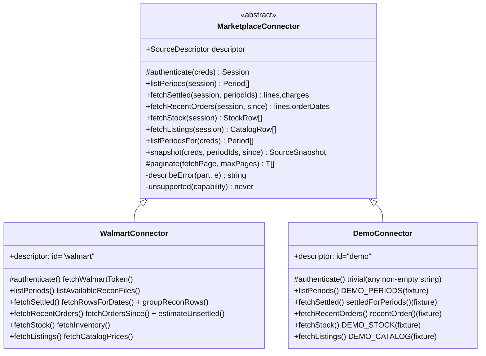
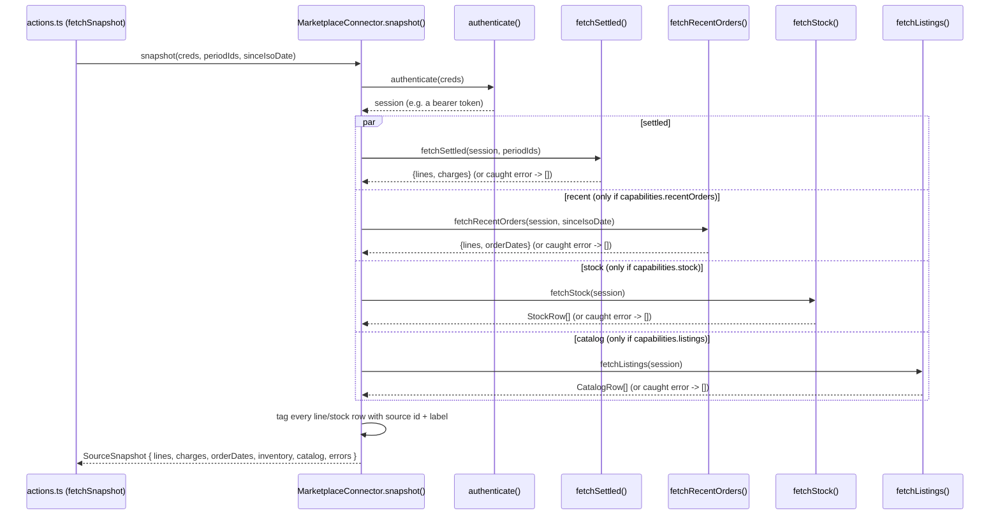
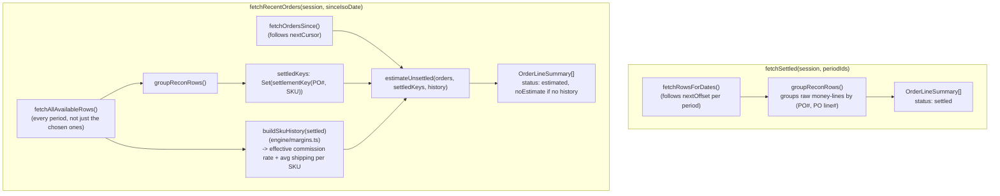

# Connectors

> [Documentation Index](../index.md) · Up: [Architecture Overview](./architecture.md) · Related: [Gateway Contract](./gateway-contract.md) · [Engine](./engine.md)
> Practical checklist for adding one: [`docs/adding-a-marketplace.md`](../adding-a-marketplace.md)

## Overview

A connector is the only code in the repository allowed to know a specific marketplace's field names, auth flow, pagination quirks, and fee vocabulary. Every connector is a subclass of `MarketplaceConnector` ([`connectors/base.ts`](../../lib/gateway/connectors/base.ts)), registered in [`connectors/registry.ts`](../../lib/gateway/connectors/registry.ts). Two exist today:

| Connector | Folder | Real network calls? | Purpose |
|---|---|---|---|
| **Walmart** | `connectors/walmart/` | Yes | The one production marketplace integration |
| **Demo** | `connectors/demo/` | No (fixtures) | Proves the `MarketplaceConnector` abstraction against a second implementation with no credentials needed; lets multi-source UI be developed/tested without Amazon/eBay access |

Amazon and eBay are planned (see [`docs/multi-marketplace-plan.md`](../multi-marketplace-plan.md) phases 5–6) but not implemented — no folders exist for them yet.

## Responsibilities

- Exchange pasted credentials for a session/token (`authenticate`), and never let that token or the raw credentials escape the connector.
- List settlement/payout periods (`listPeriods`) and fetch settled money-lines for chosen periods (`fetchSettled`).
- Fetch recent/unsettled orders (`fetchRecentOrders`), normalized with no customer PII, estimating fees from settled history where the base class's shared plumbing doesn't already do it.
- Optionally fetch stock levels (`fetchStock`) and catalog/listing data (`fetchListings`) when `capabilities` claims support.
- Never let a raw marketplace payload cross into `engine/` or the dashboard — only `OrderLineSummary`, `AccountCharge`, and plain stock/catalog rows may leave a connector folder.

## The `MarketplaceConnector` base class



`base.ts` holds the plumbing that used to be duplicated per-API-module before the gateway carve-out:

- **`snapshot()`** — the orchestration every connector gets for free: authenticate once, then fetch settled lines, recent orders, stock, and listings **in parallel**, catching each part's failure independently (`Promise.all` with per-branch `.catch`) so e.g. a catalog 404 doesn't take down settled data. Every line gets tagged with `source`/`sourceLabel` before returning.
- **`paginate()`** — a shared cursor-pagination helper with a hard page cap (`maxPages`); throws rather than silently truncating.
- **`describeError()`** — wraps any thrown error with the connector's label and the part that failed, and deliberately never includes credential material (credentials never reach this far down the call stack anyway).
- **Default `fetchStock`/`fetchListings`** throw `"<label> connector does not support <capability>"` — a connector only needs to override the ones its `descriptor.capabilities` claims to support.
- **"Throw, never return partial data"** is a repeated policy across every connector's pagination code (see the Walmart section below) — a truncated page silently read as "SKU not stocked" or "nothing here" would be worse than a loud failure.

## `snapshot()` orchestration, in detail



A capability the connector doesn't declare (e.g. Demo without `stock: false`, hypothetically) is simply never called — the `Promise.all` array substitutes an already-resolved empty result instead of invoking the unsupported method, so `unsupported()` in practice only fires if a `capabilities` flag and an actual override disagree (a bug, not a normal path).

## The registry

[`connectors/registry.ts`](../../lib/gateway/connectors/registry.ts) is a flat array:

```ts
export const CONNECTORS: MarketplaceConnector[] = [
  new WalmartConnector(),
  new DemoConnector(),
];
```

`describeSources()` in `actions.ts` maps this array to `descriptor`s; `listPeriods`/`fetchSnapshot` filter it by which sources have credentials filled in. **Adding a marketplace is one new connector class plus one line here** — no dashboard code changes, per the design goal recorded in [`docs/multi-marketplace-plan.md`](../multi-marketplace-plan.md). See [`docs/adding-a-marketplace.md`](../adding-a-marketplace.md) for the full checklist, including the required validation commands (`test:engine`, `test:csv`, `check:boundary`, `lint`, `build`).

## The Walmart connector

Real API-backed reference implementation, split into one file per API area:

| File | Covers |
|---|---|
| [`walmart/auth.ts`](../../lib/gateway/connectors/walmart/auth.ts) | `POST /v3/token`, client-credentials grant; two token-fetch paths (see below) |
| [`walmart/recon.ts`](../../lib/gateway/connectors/walmart/recon.ts) | Settlement/reconciliation report listing + paginated fetch |
| [`walmart/orders.ts`](../../lib/gateway/connectors/walmart/orders.ts) | `GET /v3/orders` — recent/unsettled orders |
| [`walmart/inventory.ts`](../../lib/gateway/connectors/walmart/inventory.ts) | `GET /v3/inventories` — on-hand stock |
| [`walmart/items.ts`](../../lib/gateway/connectors/walmart/items.ts) | `GET /v3/items` — catalog price + publish status |
| [`walmart/normalize.ts`](../../lib/gateway/connectors/walmart/normalize.ts) | `classify`, `groupReconRows`, `estimateUnsettled` — raw rows → `OrderLineSummary[]` |
| [`walmart/connector.ts`](../../lib/gateway/connectors/walmart/connector.ts) | The `MarketplaceConnector` subclass wiring the above together |

### Two token-fetch paths, deliberately not shared

```ts
fetchWalmartToken(clientId, clientSecret)   // per-request, uncached — used by the dashboard's multi-tenant flow
getWalmartToken()                            // env-var credentialed, cached in-process — for a future single-tenant background job (cron/sync)
```

`fetchWalmartToken` is **deliberately uncached**: credentials arrive per-request from a form, potentially a different seller each time, so a shared cache would leak one seller's token into another seller's request. `getWalmartToken` (used only by `scripts/test-walmart-connection.ts` today) reads `WALMART_CLIENT_ID`/`WALMART_CLIENT_SECRET` from the environment and caches the token for the life of the process — appropriate for a future cron job that always acts as one account, wrong for the multi-tenant dashboard flow.

### Settled vs. estimated lines



Two important design choices here:

1. **`fetchRecentOrders` reads *every* available settlement period**, not just the ones the user selected to view, specifically so "settled" and the fee-estimate history mean the same thing regardless of which periods happen to be displayed. This is more network traffic than strictly needed for display, but keeps the settled/estimated split consistent.
2. **Matching settled ↔ recent orders is by `(purchaseOrderNo, normalizeSku(sku))`, never by line number** — `settlementKey()` in `engine/margins.ts`. This exists because Walmart's own APIs have been observed to disagree with themselves on line numbers for the same order (documented in [`docs/walmart-api-notes.md`](../walmart-api-notes.md)).

### Fee classification (`normalize.ts`)

```ts
function classify(amountType: string, description: string): Component {
  if (amountType === "Product Price") return "revenue";
  if (amountType === "Commission on Product") return "commission";
  if (amountType.startsWith("Product tax")) return "tax";
  if (/shipping/i.test(description)) return "shipping";
  return "otherFees";
}
```

Shipping is matched on **description text**, not `Amount Type`, because Walmart files shipping label charges under the generic `Adjustment` / `Fee/Reimbursement` type with a description like `Walmart Shipping Label Service Charge`. Anything unmatched falls into `otherFees` rather than being dropped — and because `netAmount` sums every row regardless of classification, **profit is correct even if a fee type is misclassified**; only the fee breakdown and channel label would be wrong (see [Engine — `computeMargins`](./engine.md#computemargins-per-line-profit)).

**Rows with no Purchase Order # are dropped** by `groupReconRows` (account-level rows like `PaymentSummary`, and — expected but unverified — WFS storage fees). This is a known, explicitly tracked gap: see [Known gaps](#known-gaps-and-unverified-behavior) below.

### Pagination quirks (Walmart-specific, verified live)

Each of these is documented in full in [`docs/walmart-api-notes.md`](../walmart-api-notes.md); summarized here because they directly explain the shape of the connector code:

| Endpoint | Quirk | Where handled |
|---|---|---|
| `reconFileJson` (settlement) | Paging ends at `nextOffset === -1`, not an empty page | `fetchAllRowsForDate` in `recon.ts` |
| `inventories` | `limit` caps at 50 (not documented); cursor must go back as `nextCursor` query param (**not** appended to the URL, **not** named `cursor`); every page must repeat the same `limit` | `fetchInventory` in `inventory.ts` |
| `items` (catalog) | Offset paging is unsafe (item order changes between calls); a cursor is only returned if the *first* request asks with `nextCursor=*`; end-of-data is a `404 CONTENT_NOT_FOUND`, treated as "done," not a failure | `fetchCatalogPrices` in `items.ts` |
| `orders` | Cursor is appended to the base URL (opposite of the inventories endpoint); **unverified** for accounts with more than one page | `fetchOrdersSince` in `orders.ts` |

Every one of these pagination loops **throws rather than returning a partial list** on an unexpected failure or an exhausted page cap — a silently truncated inventory or catalog list would read as "SKU not stocked" / "no listed price," which is worse than a loud error.

### Fulfillment channel

`Fulfillment Type` is a real field on Walmart's settlement rows (`Seller Fulfilled` observed; WFS not yet observed live) — it does not need to be inferred from which fee types appear, contrary to an earlier assumption recorded in the multi-marketplace plan. See [`docs/walmart-api-notes.md`](../walmart-api-notes.md#what-a-row-is).

## The Demo connector

[`connectors/demo/connector.ts`](../../lib/gateway/connectors/demo/connector.ts) + [`connectors/demo/fixtures.ts`](../../lib/gateway/connectors/demo/fixtures.ts) implement every part of the `MarketplaceConnector` contract against fixed in-memory data — two settlement periods, two SKUs, one of them (`DEMO-WIDGET-1`) chosen so per-SKU rollups have something real to combine if a Walmart account also carries that SKU. `authenticate` accepts any non-empty "Demo account name" string; nothing ever leaves the browser tab.

Its purpose, stated directly in its own doc comment: **"if the dashboard works fully against this with no dashboard-side special cases, the `MarketplaceConnector` abstraction holds."** It's the reference to copy from when starting a new connector with no real API to test against yet (per [`docs/adding-a-marketplace.md`](../adding-a-marketplace.md)).

## What a connector must implement

See [`docs/adding-a-marketplace.md`](../adding-a-marketplace.md) for the full step-by-step. The essential contract, summarized:

- `descriptor`: a stable, lowercase `id` (never renamed once shipped), a display `label`, `credentialFields` (drives the dashboard's connect form automatically), and `capabilities` flags.
- `authenticate(creds)`: `protected` — only the base class calls it, from `snapshot()` and `listPeriodsFor()`. No credential is ever visible above the connector after this point.
- `listPeriods`, `fetchSettled`, `fetchRecentOrders`: required.
- `fetchStock`, `fetchListings`: optional overrides, only implement what `capabilities` claims.
- Every `OrderLineSummary` produced must have its fee components (`commission`, `shipping`, `tax`, `otherFees`) sum to `netAmount` — this invariant is what lets the engine compute correct profit regardless of classification accuracy (see [Engine](./engine.md)).
- If nothing has settled yet for a SKU, project fees from that SKU's own settled history (the `estimateUnsettled` pattern) — never invent a rate from a published rate card.
- `import "server-only";` at the top of `connector.ts` (and any file not also exercised by a `scripts/test-*.ts` connectivity script) — this is what makes it structurally impossible for connector code to end up in the browser bundle, even by accident, independent of the ESLint import boundary. See [Configuration & Security](./configuration-and-security.md#the-gateway-import-boundary).

## Known gaps and unverified behavior

These are tracked explicitly in the source rather than silently assumed correct — worth reading before extending this area:

- **WFS storage fees would silently vanish.** `groupReconRows` drops any row with no Purchase Order #, which is exactly how WFS storage fees are expected to arrive (per Walmart's docs; **not yet observed live**, since the account this was built against is all seller-fulfilled). Once WFS activity appears, these costs need to become an `AccountCharge` instead of being dropped. See [`multi-marketplace-plan.md`](../multi-marketplace-plan.md#where-the-code-is-coupled-to-walmart-today).
- **Refunds and returns are unhandled** — none have been observed against the live account this was built against, so there's nothing to design against yet.
- **The Orders API cursor form is unverified** — the test account never had more than one page of orders.
- **`chargeAmount` semantics for quantity > 1 are unverified** — every observed order line has been quantity 1.
- **Inventory paging past 50 SKUs is verified only by artificially forcing small page sizes**, not by a real account that size.

See [`docs/walmart-api-notes.md`](../walmart-api-notes.md#still-unverified) for the complete, authoritative list — that file is the canonical source; this page summarizes it in connector-code terms.

## Related documentation

- [`docs/adding-a-marketplace.md`](../adding-a-marketplace.md) — step-by-step checklist for a new connector
- [`docs/walmart-api-notes.md`](../walmart-api-notes.md) — full verified behavior of Walmart's API, including every pagination gotcha
- [Engine](./engine.md) — what consumes `OrderLineSummary`/`AccountCharge` once a connector produces them
- [Gateway Contract](./gateway-contract.md) — `SourceDescriptor`, `Snapshot`, and how `actions.ts` calls into the registry
- [Configuration & Security](./configuration-and-security.md) — the `server-only` guarantee and the ESLint import boundary
