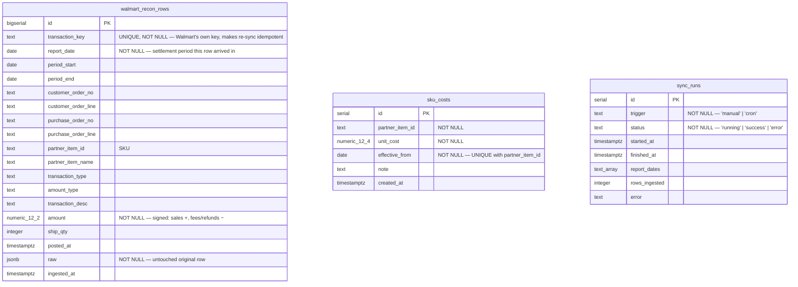

# Data Model (Provisioned, Unused)

> [Documentation Index](../index.md) · Up: [Architecture Overview](./architecture.md) · Related: [Configuration & Security](./configuration-and-security.md) · [Testing & Deployment](./testing-and-deployment.md)

## Status: provisioned but not read or written by the running app

**This is the single most important fact about this part of the codebase**: a Neon Postgres database is provisioned, and a Drizzle ORM schema exists for it, but **no code path in the running application reads from or writes to it.** This is stated directly in the README ("Persistence (planned, not built)") and in [`walmart-margin-tracker-plan.md`](../../walmart-margin-tracker-plan.md) ("Current Build: Stateless MVP"). The app is fully stateless in production — see [Configuration & Security](./configuration-and-security.md#nothing-is-stored).

Do not infer from the schema's existence that any of the tables below are populated in production, or that any user data currently persists across a page refresh. They don't, and it doesn't.

## Why it exists anyway

The schema and database were provisioned during an earlier phase of the project (recorded as "Phase 0" / "Phase 1" in [`walmart-margin-tracker-plan.md`](../../walmart-margin-tracker-plan.md)), when the intended design was a persisted margin tracker backed by Postgres. Partway through, the project pivoted to a stateless, no-login MVP — Vercel Authentication was enabled and then explicitly disabled (2026-09-23 → 2026-09-24), and the pasted API key became the sole access control. The schema was left in place because **persistence is still the planned next step** (saving purchase batches and box details specifically — see the README's "Known limitations"), not because it's dead code slated for removal. Optional sign-in now exists ([Authentication](./authentication.md)), so saved data has an owner to key off: the session's `userId`.

## Files

| File | Role |
|---|---|
| [`lib/db/schema.ts`](../../lib/db/schema.ts) | Drizzle ORM table definitions (the source of truth for the schema) |
| [`lib/db/index.ts`](../../lib/db/index.ts) | `getDb()` — lazily-initialized Neon/Drizzle client |
| [`drizzle.config.ts`](../../drizzle.config.ts) | `drizzle-kit` config: schema path, output dir, Postgres dialect |
| [`drizzle/0000_init.sql`](../../drizzle/0000_init.sql) | The one migration generated so far |
| `drizzle/meta/` | Drizzle-kit's internal snapshot/journal bookkeeping |

## Entity-relationship diagram



**No foreign keys exist between these tables.** They're linked only by convention, on the application side, via `partner_item_id` (SKU) and `purchase_order_no`/`purchase_order_line` — there is no `skus` table; per the original plan, the SKU list would derive from `SELECT DISTINCT partner_item_id FROM walmart_recon_rows`.

## Table-by-table

### `walmart_recon_rows` — raw, append-only

One row per Walmart settlement money-line (the same granularity as a `ReconRow` in the live [Walmart connector](./connectors.md#the-walmart-connector), before any grouping into order lines). Indexed on `(purchase_order_no, purchase_order_line)`, `partner_item_id`, and `report_date`.

- **Never updated or deleted.** The design rationale (from `walmart-margin-tracker-plan.md`): refunds and adjustments for a sale routinely land in a *later* settlement period, so a stored, mutable margin would go stale the moment a refund arrived — appending and computing margin on read means late-arriving rows are automatically reflected.
- **`raw jsonb` keeps the untouched original row.** Walmart adds and renames amount types over time; keeping the raw payload means a future classification bug can be fixed with a query change instead of a full re-download.
- **`transaction_key` is unique** and doubles as an idempotency key — re-syncing a period that's already been ingested would be safe (if a sync job existed; none does today, see [below](#the-planned-sync-job-not-implemented)).

### `sku_costs` — effective-dated

One cost per SKU per effective date (`unique(partner_item_id, effective_from)`), so a cost *change* doesn't rewrite history — a margin computed for a past order should use the cost that was true on that order's date, not today's cost. This is the persisted equivalent of the in-memory `CostLot`/`SkuInputs` shapes the [engine](./engine.md#cost-model-purchase-batches-not-a-single-number) uses today, but note the shapes don't match one-to-one: `sku_costs` is a single `unit_cost`, while the live stateless app's cost model is a *list* of purchase batches (`CostLot[]`, quantity × price each, averaged by quantity). Reviving persistence would need a lots table, not a straight revival of this table — this is called out explicitly as an open item in `walmart-margin-tracker-plan.md`.

### `sync_runs` — observability + concurrency guard

Would record each backfill/sync attempt (`trigger`: manual or cron; `status`: running/success/error) and prevent overlapping runs. Nothing in the current codebase creates or reads a `sync_runs` row — there is no sync endpoint or cron job implemented (see below).

## The planned sync job — not implemented

The original plan (`walmart-margin-tracker-plan.md`'s "Repo Structure" section, and the "Build Phases" table) called for `app/api/sync/walmart/route.ts` (manual trigger) and `app/api/cron/sync/route.ts` (daily cron target), which would populate `walmart_recon_rows` and `sync_runs`. **Neither route exists in this repository.** "Phase 7 — Automate" is listed as "Not started; belongs with persistence" in the plan doc. If you're looking for where data ingestion into Postgres happens: it doesn't, anywhere in this codebase, today.

## `getDb()` — the lazy-initialization pattern

```ts
let _db: ReturnType<typeof drizzle<typeof schema>> | null = null;
export function getDb() {
  if (!_db) {
    const sql = neon(process.env.DATABASE_URL!);
    _db = drizzle(sql, { schema });
  }
  return _db;
}
```

This exists in a very deliberate shape, per its own doc comment: `neon()` throws immediately if `DATABASE_URL` is unset, and **Next.js evaluates top-level module code at build time** — so a naive `const db = drizzle(neon(process.env.DATABASE_URL!))` at module scope would crash `next build` the moment this module is imported, even before any request runs, and even before Neon was provisioned in this project's history. The comment also specifically warns against replacing the cached `let` with a `Proxy` wrapper for the same laziness — a `Proxy` here has been observed to break libraries (e.g. NextAuth) that inspect the client object directly. **No code in the app currently calls `getDb()`** — it exists ready for the day persistence is revived, per [`docs/multi-marketplace-plan.md`](../multi-marketplace-plan.md)'s "Persistence / login" phase (explicitly deferred).

## Configuration

| Variable | Source | Used by |
|---|---|---|
| `DATABASE_URL` | Injected automatically by `vercel integration add neon` / `vercel env pull` | `getDb()` (uncalled today), `drizzle.config.ts` (for `db:push`/`db:studio`) |

See [Configuration & Security](./configuration-and-security.md#environment-variables) for the full environment variable table.

## npm scripts touching this schema

| Script | Effect |
|---|---|
| `npm run db:push` | Applies `lib/db/schema.ts` to the Neon database via `drizzle-kit push`. The README calls this "unused by the app today." |
| `npm run db:studio` | Opens Drizzle Studio against the same database. |

Both require `DATABASE_URL` (loaded from `.env.local` via `dotenv-cli`, per the `package.json` script definitions — see [Testing & Deployment](./testing-and-deployment.md)).

## Related documentation

- [`walmart-margin-tracker-plan.md`](../../walmart-margin-tracker-plan.md) — "Current Build: Stateless MVP" (what's actually live) and the full original persisted-architecture design (data model, margin-as-derived-query rationale, build phases) below it
- [`docs/multi-marketplace-plan.md`](../multi-marketplace-plan.md) — "Decisions," item 4: "Persistence: stay stateless for now"
- [Engine](./engine.md#cost-model-purchase-batches-not-a-single-number) — the in-memory `CostLot`/`SkuInputs` shapes that stand in for this schema today
- [Configuration & Security](./configuration-and-security.md) — why statelessness is the security model, not just a scoping decision
