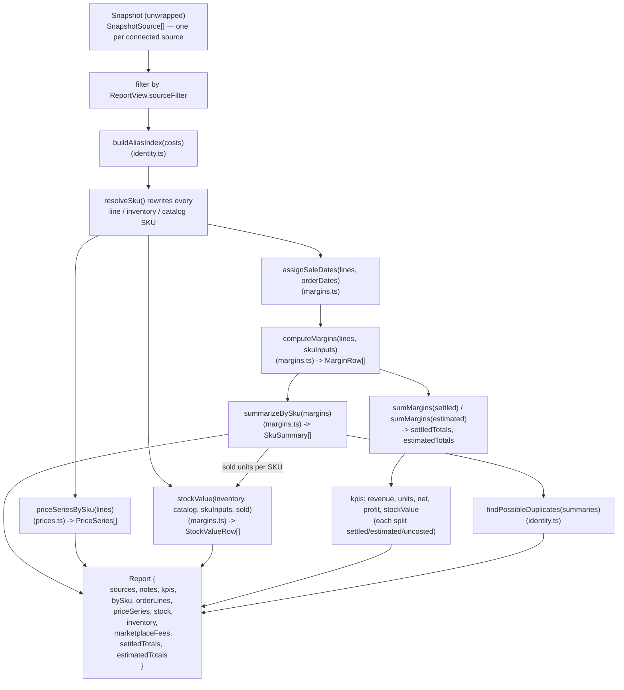
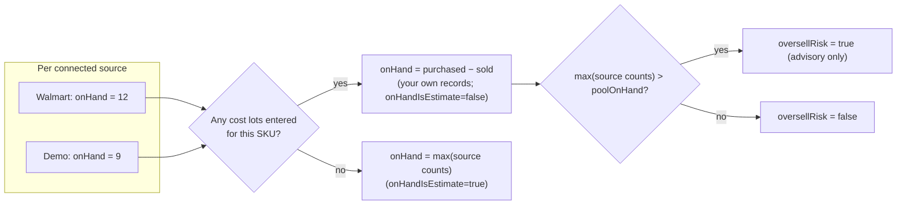
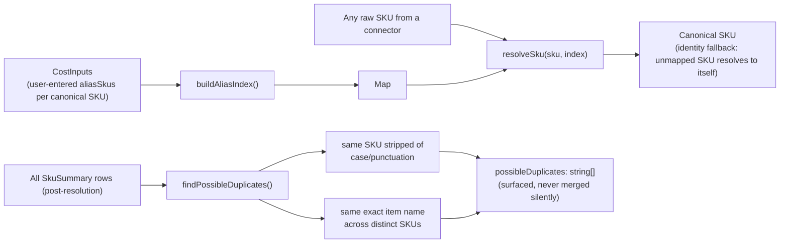
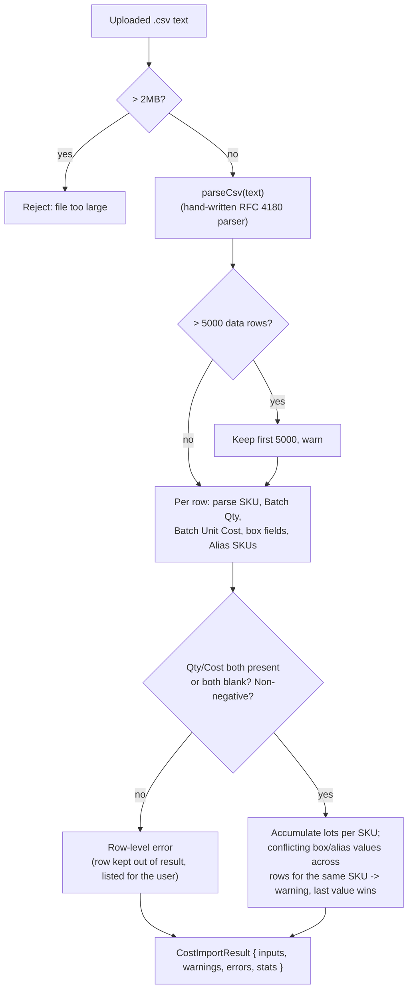

# Engine (Pure Calculation Layer)

> [Documentation Index](../index.md) · Up: [Architecture Overview](./architecture.md) · Related: [Middleware Contract](./middleware-contract.md) · [Connectors](./connectors.md) · [Frontend](./frontend.md)

## Overview

`lib/middleware/engine/` is every dollar-figure calculation in the app, and it is deliberately **marketplace-neutral**: nothing in this folder imports a connector, makes a network call, or knows a Walmart field name. It consumes only the canonical `OrderLineSummary` shape (`engine/types.ts`) that every connector's normalization code produces. This neutrality is enforced socially, not mechanically — `npm run test:engine` pins today's numbers as a fixture regression so a refactor can prove it changed nothing (see [Testing & Deployment](./testing-and-deployment.md#npm-run-testengine)).

## Responsibilities

- Turn raw settled + estimated order lines into per-line and per-SKU margins (`margins.ts`).
- Estimate fees for orders that haven't settled yet, from each SKU's own settled history (this part actually lives in the Walmart connector — see [note below](#where-estimation-actually-lives)).
- Resolve SKU identity: normalize casing, apply user-declared aliases across marketplaces, and flag likely-duplicate SKUs that *aren't* aliased (`identity.ts`).
- Compute stock-on-hand and its dollar value, pooled across sources rather than summed (`margins.ts`'s `stockValue`).
- Build day-by-day average selling price series per SKU (`prices.ts`).
- Define the CSV shapes for order lines, SKU summaries, and cost import/export, including formula-injection guarding (`csv.ts`).
- Assemble all of the above into the `Report` the dashboard renders (`report.ts`).

## Files

| File | Exports | Role |
|---|---|---|
| [`engine/types.ts`](../../lib/middleware/engine/types.ts) | `OrderLineSummary`, `normalizeSku` | The canonical line-item shape every connector normalizes into |
| [`engine/margins.ts`](../../lib/middleware/engine/margins.ts) | `computeMargins`, `summarizeBySku`, `sumMargins`, `stockValue`, `reconcileStock`, `buildSkuHistory`, `settlementKey`, `assignSaleDates`, cost-lot helpers | The core margin, stock, and cost math |
| [`engine/identity.ts`](../../lib/middleware/engine/identity.ts) | `buildAliasIndex`, `resolveSku`, `findPossibleDuplicates` | SKU identity resolution across sources |
| [`engine/prices.ts`](../../lib/middleware/engine/prices.ts) | `priceSeriesBySku` | Price-over-time series for the chart |
| [`engine/csv.ts`](../../lib/middleware/engine/csv.ts) | `toCsv`, `orderLinesToCsv`, `skuSummaryToCsv`, `costsToCsv`, `parseCsv`, `parseCostImportCsv` | CSV encode/decode, shared by every export/import feature |
| [`engine/report.ts`](../../lib/middleware/engine/report.ts) | `buildReport` | Assembles everything above into a `Report` |

## Data flow: `buildReport`'s pipeline



This is a straight-line pure function: no step performs I/O, and every step after alias resolution operates on SKUs that are already in their canonical identity.

## `buildReport`: assembling the `Report`

`buildReport(snapshot, costs, view)` in [`engine/report.ts`](../../lib/middleware/engine/report.ts) is the sole entry point the dashboard calls (re-exported from `lib/middleware/index.ts`). Its steps, in order:

1. **Unwrap** the opaque `Snapshot` back to `SnapshotData` (the only place allowed to).
2. **Filter sources** by `view.sourceFilter` ("all" or an explicit id list).
3. **Resolve SKU identity** — build an alias index from `costs[sku].aliasSkus`, then rewrite every line/inventory/catalog SKU through `resolveSku`. This happens *before* any grouping, so every SKU-keyed lookup downstream sees the same canonical key.
4. **Assign sale dates** to every line (real order date where known, else the settlement posting date, tagged `saleDateBasis`).
5. **Compute margins** per line, then **summarize by SKU**.
6. **Compute price series** and **stock value**, the latter fed the per-SKU sold-units count from step 5's summaries.
7. **Sum settled vs. estimated totals** and derive the five KPI tiles' figures.
8. Return the finished `Report`.

## Margin calculation (`margins.ts`)

### Cost model: purchase batches, not a single number

```ts
interface CostLot { qty: number; unitCost: number; }
```

A SKU's inputs (`SkuInputs`) hold zero or more `CostLot`s. `averageUnitCost` is the **quantity-weighted average** across all valid lots (qty > 0, unitCost ≥ 0) — not FIFO, because batches carry no dates. This is a deliberate design decision recorded in [`walmart-margin-tracker-plan.md`](../../walmart-margin-tracker-plan.md): batches record what was paid *including for units already sold*, so `totalPurchased` legitimately exceeds current on-hand stock.

### `computeMargins`: per-line profit

```
itemCostTotal = averageUnitCost(lots) × line.qty      (0 if no lots entered)
boxCostTotal  = boxCost                                 (flat per shipment, not scaled by qty)
costTotal     = itemCostTotal + boxCostTotal
profit        = line.netAmount − costTotal
margin        = profit / line.revenue   (null if revenue is 0)
```

**Key invariant:** `profit` is correct even for a SKU with nothing entered yet (`costTotal` falls back to 0) or a fee that couldn't be classified, because `netAmount` already sums *every* component the connector produced for that line. Only the margin *percentage* — and any fee-category breakdown — depends on the connector's classification being right. `hasCost` (whether *any* valid lot exists) is what the UI checks before showing profit, not whether `costTotal` happens to be nonzero.

### `summarizeBySku`: rolling lines up per product

Groups `MarginRow[]` by normalized SKU. The critical rule here: figures derived from money (`avgPrice`, `shippingPct`, `margin`, `totals`) are computed only over lines where `!noEstimate` (`counted`), while unit/line *counts* (`units`, `lines`) cover every line including non-estimable ones. Mixing an all-rows revenue with a filtered profit would silently corrupt the margin — the code comment in `margins.ts` calls this out explicitly. `hasMoney` (`counted.length > 0`) is what the UI checks to decide between showing figures and showing "No settled history yet."

Rows are sorted by **revenue descending**, not profit — sorting by profit would reshuffle the table as a user types costs in, since unentered costs inflate profit.

### `stockValue`: pooled, never summed, across sources



The same physical inventory shows up in every connected marketplace's own count — summing them would double-count stock. Instead:

- **With any cost lots entered**, the valuation quantity is your own pool figure: `purchased − sold`, from `reconcileStock`/`totalPurchased`. Each source's own reported count is still shown (`bySource`), never summed.
- **With no lots entered**, it falls back to the largest single source's count, marked `onHandIsEstimate: true`.
- **`oversellRisk`** fires when a source's count exceeds what your purchase records imply is left — advisory only; it is never blocking, because real stock drift happens (damage, returns, stock held but not listed) and blocking data entry on it would be unusable.
- **Unpublished listings** (`isPublished: false`) show a price but are excluded from `valueAtPrice`'s total, because that stock can't currently sell.
- A missing figure is `null`, never `0`; totals report how many SKUs they cover (`costedSkus`, `pricedSkus`) so a partial total can never silently read as the whole picture.

### `reconcileStock`: advisory discrepancy check

```ts
impliedOnHand = purchased − sold
discrepancy   = onHand === null || purchased === 0 ? null : impliedOnHand − onHand
```

Used by the Inventory & Costs tab's "Left" column (amber when nonzero) — a hint that a batch is missing or mistyped, never a hard constraint. See [Frontend — Inventory & costs tab](./frontend.md#inventory--costs-tab).

### Box dimensions and dimensional weight

```ts
DIM_DIVISOR = 139   // common domestic-ground carrier divisor
cubicInches(i) = boxLength × boxWidth × boxHeight   (null if any dimension is missing)
dimWeight(i)   = cubicInches(i) / DIM_DIVISOR
```

Purely informational — shown so an oversized box's shipping cost is *explainable*, not a claim about what a carrier actually billed.

## SKU identity resolution (`identity.ts`)



- **Default identity**: `normalizeSku(sku)` (trim + uppercase) is a product's key. The same SKU on two marketplaces is automatically one product.
- **Explicit aliases**: `CostInputs[sku].aliasSkus` lets a user declare "these other SKUs are the same physical product." `buildAliasIndex` inverts that into a lookup from alias → canonical key; `resolveSku` is applied to every line, inventory row and catalog row in `buildReport` *before* any grouping happens.
- **Possible duplicates are never merged automatically** — `findPossibleDuplicates` only flags SKUs that look related (stripped-string match or identical item name) so a human can decide whether to alias them. This is the deliberate boundary called out in [`multi-marketplace-plan.md`](../multi-marketplace-plan.md#product-identity-phase-4-engine): "near-matches are flagged, never merged silently."

## Price series (`prices.ts`)

`priceSeriesBySku` groups lines by SKU and by `saleDate`, producing one `PricePoint` per day that had sales (`avg`/`min`/`max` price, `orders`, `units`). Price is `revenue / qty` taken straight from the order — exact even for lines whose *fees* can't be estimated (`noEstimate`), since price doesn't depend on fee classification. `approxPoints` counts points placed on the settlement posting date rather than the real order date (lines older than the 60-day recent-orders window) — surfaced in the UI rather than silently blended. Series are sorted by units sold, so a caller capping the number of charted lines (the frontend caps at 6 — see [Frontend — Price chart](./frontend.md#price-chart)) keeps the highest-volume products.

## CSV shapes (`csv.ts`)

All CSV encoding funnels through `toCsv(headers, rows)`, which:

- Prefixes a UTF-8 BOM so Excel reads accented characters correctly.
- Quotes per RFC 4180 (commas, quotes, CR/LF trigger quoting; embedded quotes are doubled).
- **Guards against spreadsheet formula injection**: any string cell starting with `=`, `+`, `-`, `@`, tab or CR gets a leading apostrophe (`guardFormula`). This is the same defense noted in [Configuration & Security](./configuration-and-security.md#csv-formula-injection-guard).
- Numbers are exempt from formula-guarding (a legitimate `-12.50` must stay numeric).

Three export shapes (`orderLinesToCsv`, `skuSummaryToCsv`, `costsToCsv`) and one import parser (`parseCostImportCsv`), all leaving a cell blank rather than `0` wherever a figure genuinely isn't known — the same "never show a fake zero" rule that governs the UI.

`parseCostImportCsv` is the more involved of the two directions:



Import is **preview-then-confirm**: `parseCostImportCsv` never mutates any application state by itself — `DashboardClient` shows the result in an `ImportPreviewCard` and only applies it (replacing the session's `inputs`/`lotDrafts`/`aliasDrafts`) when the user clicks "Apply import." See [Frontend — Inventory & costs tab](./frontend.md#inventory--costs-tab).

## Where estimation actually lives

One subtlety worth flagging for anyone modifying this area: **`buildSkuHistory` lives in `engine/margins.ts`** (it's a general per-SKU average of settled commission rate and shipping cost, keyed by normalized SKU — nothing Walmart-specific about the shape), but **`estimateUnsettled`, the function that actually turns a recent unsettled order into an estimated line, lives in `connectors/walmart/normalize.ts`**, because it consumes Walmart's raw `Order`/charge shape. Every connector is expected to implement its own version of this pattern against its own recent-orders shape (see [Connectors — Implementing a connector](./connectors.md#what-a-connector-must-implement)); the engine only supplies the neutral averaging (`buildSkuHistory`) and the settled/recent join key (`settlementKey`).

## Testing

`scripts/test-engine.ts` is a hand-written fixture regression check (no test framework is configured in this repo — see [Testing & Deployment](./testing-and-deployment.md)) covering `computeMargins`, `summarizeBySku`, `stockValue`, `reconcileStock`, `priceSeriesBySku`, `buildAliasIndex`/`findPossibleDuplicates`, and the Walmart-specific `groupReconRows`/`estimateUnsettled`. It exists specifically to prove the `lib/middleware/` carve-out (phase 1 of the multi-marketplace plan) changed zero dollar figures. `scripts/test-csv-import.ts` covers `csv.ts` separately. Run both with `npm run test:engine` / `npm run test:csv`.

## Related documentation

- [Middleware Contract](./middleware-contract.md) — the `Report`/`Snapshot`/`CostInputs` types this layer produces and consumes
- [Connectors](./connectors.md) — where `OrderLineSummary` rows actually come from
- [Frontend](./frontend.md) — how every field documented here is rendered
- [`docs/multi-marketplace-plan.md`](../multi-marketplace-plan.md) — "Inside the middleware," "Product identity," "Stock across channels"
