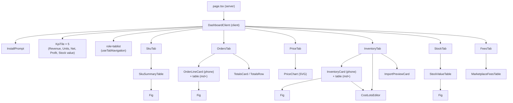
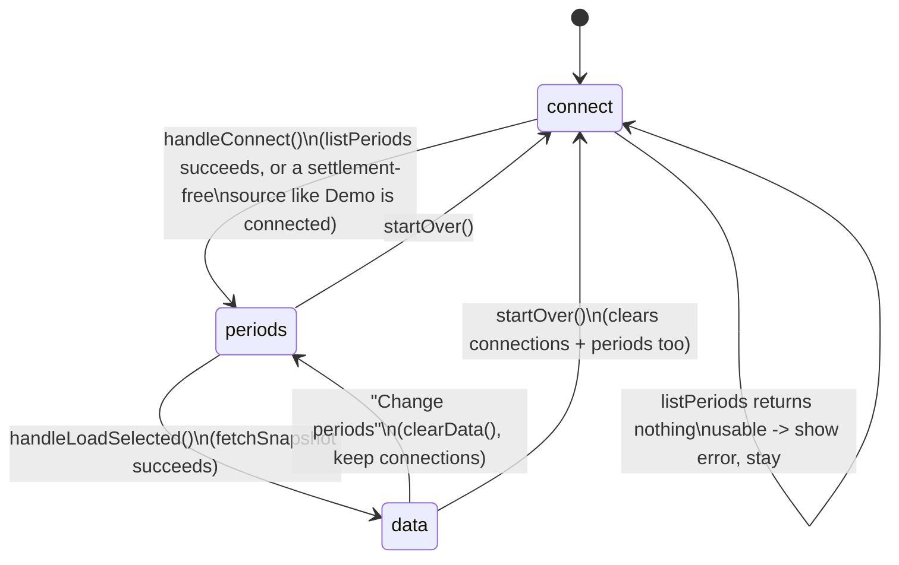

# Frontend / Dashboard

> [Documentation Index](../index.md) · Up: [Architecture Overview](./architecture.md) · Related: [Middleware Contract](./middleware-contract.md) · [Engine](./engine.md)

## Overview

The entire product surface is one Next.js App Router route: `app/(dashboard)/dashboard/`. It is a three-step wizard (connect → pick periods → view data) that becomes, once data is loaded, a tabbed dashboard with five report views plus inline cost/inventory editing. Styling is a hand-rolled "classic Mac OS (System 1) black-and-white" theme built with Tailwind CSS 4 `@apply` utilities (see `app/globals.css`, not detailed further here — purely presentational).

**The dashboard is marketplace-neutral by construction.** No file under `app/` imports a connector or `engine/*` directly, and no file names a marketplace — both facts are mechanically enforced (see [Configuration & Security](./configuration-and-security.md#the-middleware-import-boundary)). Every label, field, and figure the UI shows comes from the middleware's `SourceDescriptor`/`Report` data, not from hard-coded copy.

## Responsibilities

- Render the credential form, settlement-period picker, summary tiles, and six report tabs.
- Hold every piece of user-entered state: pasted credentials, the fetched `Snapshot`, typed costs/box dimensions/aliases, the active tab, the source filter.
- Call the two middleware server actions (`listPeriods`, `fetchSnapshot`) and the one pure function (`buildReport`) — nothing else reaches outside `app/`.
- Provide CSV download buttons (client-side `Blob` + anchor download, nothing round-trips to a server).
- Provide PWA install behavior (`InstallPrompt`) and mobile-first responsive layouts (card lists below `md`, tables above).

## Directory map

```
app/(dashboard)/dashboard/
  page.tsx                 server component: describeSources() -> <DashboardClient sources=.../>
  DashboardClient.tsx       client component: all wizard/report state (the file most edits touch)
  PriceChart.tsx            hand-built SVG line chart, no chart library
  InstallPrompt.tsx         PWA "Add to Home Screen" banner
  types.ts                  Step, Tab, SkuField, LotDraft, BOX_FIELDS
  hooks/
    useTabNavigation.ts      active tab state + ARIA arrow-key navigation + scroll-into-view
  utils/
    format.ts                 money(), downloadCsv()
    shipping.ts                shipPctClass() — amber/red threshold styling
  components/
    KpiTile, PanelHeader, Fig, ImportPreviewCard  (components/shared/)
    CostLotsEditor, InventoryCard, OrderLineCard,
    SkuSummaryTable, StockValueTable,
    MarketplaceFeesTable, TotalsRow/TotalsCard      (per-domain table/card components)
    tabs/
      SkuTab, OrdersTab, PriceTab,
      InventoryTab, StockTab, FeesTab                (one component per dashboard tab)
```

This structure is the result of a refactor ("Modularize the dashboard: extract components, hooks, and utils from DashboardClient" — see repo history) that pulled tab bodies and reusable table/card pieces out of what was previously one large file; `DashboardClient.tsx` now owns state and wiring, `components/tabs/*` own each tab's layout, and `components/*`/`components/shared/*` own the reusable display pieces.

## Component tree



`Fig` (`components/shared/Fig.tsx`) is the smallest reusable piece — a label-over-value pair used across every card-view component on phone widths. `PanelHeader` gives every tab a consistent title + optional action button (typically "Download CSV") + description line.

## Wizard state machine



`Step` (`connect | periods | data`) lives in `DashboardClient` state. Note the asymmetry: **"Change periods" clears the report data but keeps the pasted credentials**; **"Start over" clears everything**, including credentials — both are explicit, separate actions in the UI.

## State shape (`DashboardClient`)

| State | Type | Holds |
|---|---|---|
| `connections` | `Record<sourceId, Record<fieldKey, string>>` | Pasted credentials, per source |
| `periodsBySource` | `Record<sourceId, PeriodList>` | Result of `listPeriods` |
| `selectedPeriods` | `Record<sourceId, Set<string>>` | Checked periods per source |
| `snapshot` | `Snapshot \| null` | Opaque result of `fetchSnapshot` — see [Middleware Contract](./middleware-contract.md#the-snapshot-brand) |
| `sourceFilter` | `string[] \| "all"` | Which connected sources' data to include in the report |
| `inputs` | `Record<sku, Partial<Record<SkuField, string>>>` | Raw *string* box-dimension/box-cost fields, keyed by normalized SKU |
| `lotDrafts` | `Record<sku, LotDraft[]>` | Raw *string* qty/unitCost pairs per purchase batch |
| `aliasDrafts` | `Record<sku, string>` | Raw comma/semicolon-separated alias SKU text per SKU |
| `expanded` | `Set<sku>` | Which SKUs' purchase-batch editor is open |
| `importPreview` | `CostImportResult \| null` | Parsed-but-not-yet-applied CSV import |

**Why raw strings, not parsed numbers:** inputs are kept as strings (`inputs`, `lotDrafts`) so a half-typed value like `"1."` doesn't fight the controlled input's value on every keystroke. A `useMemo` (`parsedInputs`) converts everything to the real `CostInputs` shape — parsing each field with `parseFloat`, dropping `NaN`s — and only *that* derived value is passed to `buildReport`. This keeps `buildReport` itself simple (it only ever sees valid numbers or `undefined`) while the UI stays forgiving of in-progress typing.

## Data flow: typing a cost to seeing a new profit figure

```mermaid
sequenceDiagram
    participant U as User
    participant Input as <input> (controlled)
    participant State as inputs/lotDrafts state
    participant Memo as parsedInputs (useMemo)
    participant Report as liveReport (useMemo -> buildReport)
    participant UI as Tables/tiles

    U->>Input: types "3.50"
    Input->>State: setField(sku, "boxCost", "3.50")
    State->>Memo: recompute (inputs changed)
    Memo->>Report: recompute (parsedInputs changed)
    Note over Report: buildReport(snapshot, parsedInputs, {sourceFilter})\npure — no network call
    Report->>UI: new Report -> re-render
```



Because `snapshot` doesn't change, this entire chain runs with **zero network calls** — the responsiveness the two-step fetch/compute split ([Middleware Contract](./middleware-contract.md#buildreport--the-pure-step)) exists to guarantee.

## Tabs

| Tab | Component | Backed by (`Report` field) | Notes |
|---|---|---|---|
| **By SKU** | `SkuTab` → `SkuSummaryTable` | `bySku: SkuSummary[]` | Per-product rollup; flags `possibleDuplicates`; CSV export |
| **Order lines** | `OrdersTab` → `OrderLineCard` (phone) / table (desktop) | `orderLines: MarginRow[]` | One row per settled or estimated line; settled/estimated totals shown separately, never blended; CSV export |
| **Price over time** | `PriceTab` → `PriceChart` | `priceSeries: PriceSeries[]` | Hand-built SVG chart — see [below](#price-chart) |
| **Inventory & costs** | `InventoryTab` → `InventoryCard` (phone) / table (desktop) | derived from `parsedInputs` + `Report.inventory` | The only tab with write operations: cost entry, box dimensions, CSV import/export |
| **Stock value** | `StockTab` → `StockValueTable` | `stock` (from `stockValue()`, see [Engine](./engine.md#stockvalue-pooled-never-summed-across-sources)) | Merchant-fulfilled only; oversell risk flagged |
| **Marketplace fees** | `FeesTab` → `MarketplaceFeesTable` | `marketplaceFees: AccountCharge[]` | Charges tied to no single order line |

Every tab follows the same **mobile-first pattern**: a `<ul>` of cards rendered below the `md` breakpoint (768px), a `<table>` rendered at `md` and above, both driven from the same data so there's no separate "mobile logic."

### Inventory & costs tab

The one tab that mutates state rather than just displaying it. Two input paths converge on the same state:

1. **Manual entry** — `CostLotsEditor` (batch qty × unit cost rows) and box-dimension inputs, wired through `setField`/`addLot`/`updateLot`/`removeLot`/`aliasDrafts`.
2. **CSV import** — `handleImportFile` reads the file, calls `parseCostCsv` (from `lib/middleware`, i.e. `engine/csv.ts`'s `parseCostImportCsv`), and stores the result in `importPreview` *without touching any other state*. `ImportPreviewCard` shows stats/warnings/errors; only clicking "Apply import" (`applyImport`) overwrites `inputs`/`lotDrafts`/`aliasDrafts` — see [Engine — CSV shapes](./engine.md#csv-shapes-csvts) for the parser itself.

"Export costs" (`costsToCsv`) doubles as an import template: exporting with nothing entered still lists every currently loaded SKU with blank batch columns, ready to fill in and re-import — a genuine round trip.

### Price chart

`PriceChart.tsx` is a hand-built inline SVG line chart — no charting library. Notable implementation choices:

- **Measures its own rendered width** via `ResizeObserver` and draws at that real pixel width (capped at 900px), rather than a fixed viewBox scaled to fit — so axis/label text stays legible on a phone instead of shrinking to unreadable sizes.
- **Caps at 6 charted series** (`MAX_SERIES`); the rest remain visible in the always-available table view.
- **Colors are positional, not value-based** — a SKU's color comes from its index among charted series and never changes, so a legend entry always means the same product.
- **Keyboard and touch support**: arrow keys move the crosshair between sale dates (ARIA `role="group"` with a descriptive label); a tap keeps the tooltip open until focus moves (unlike a mouse, which clears it on `pointerleave`) because touch fires `pointerleave` the instant a finger lifts.
- **`approxPoints`** (from `PriceSeries`, see [Engine — price series](./engine.md#price-series-pricests)) is surfaced as a footnote when any point was placed on a settlement posting date rather than the real order date.

## Tab navigation (`useTabNavigation`)

A small hook implementing the ARIA "tabs" keyboard pattern: `ArrowLeft`/`ArrowRight` cycle through `TAB_ORDER`, moving both React state and DOM focus together. It also scrolls the newly active tab into view — needed because the tab bar scrolls horizontally on a phone, so a tab selected indirectly (e.g. clicking "Enter purchase costs to see profit" inside the Profit KPI tile, which calls `setTab("inventory")`) could otherwise land off-screen.

## PWA install prompt (`InstallPrompt.tsx`)

Shown on the **connect screen**, before any credentials are entered, so it's visible on first load. Key mechanics:

- **`beforeinstallprompt` is captured at module load** (not inside the component), because the event fires once, early in page load — long before the wizard reaches this screen.
- **Platform detection** distinguishes iOS (no install API; Apple only allows Share → Add to Home Screen — the button shows numbered steps instead) from Android/Chromium (native `beforeinstallprompt` flow — the button really installs). iPadOS reports itself as `Macintosh` in its user agent, so touch-point count disambiguates it from a real Mac.
- **Dismissal** is remembered via `localStorage` (`byraf-install-dismissed`) — the *only* thing this app persists in the browser, consistent with the "nothing is stored" security model (see [Configuration & Security](./configuration-and-security.md)).
- Uses `useSyncExternalStore` with a `serverSnapshot` of `"hidden"`, so server-rendered HTML always matches the first client render (avoiding a hydration mismatch) and the real platform-detected state appears immediately after hydration.

## Legacy route

`app/(dashboard)/margins/page.tsx` is a redirect to `/dashboard`, and `app/page.tsx` redirects `/` to `/dashboard` as well. `/margins` was the route before the multi-marketplace refactor unified everything under `/dashboard`; it's kept only so old bookmarks/links keep working.

## Related documentation

- [Middleware Contract](./middleware-contract.md) — every type this UI renders (`Report`, `SourceDescriptor`, `Snapshot`)
- [Engine](./engine.md) — how the figures shown in every tab are actually computed
- [Configuration & Security](./configuration-and-security.md) — the import boundary that keeps this layer marketplace-neutral, and why nothing here is persisted
- [`README.md`](../../README.md) — the user-facing description of every tab and the mobile/PWA behavior, from the seller's point of view
