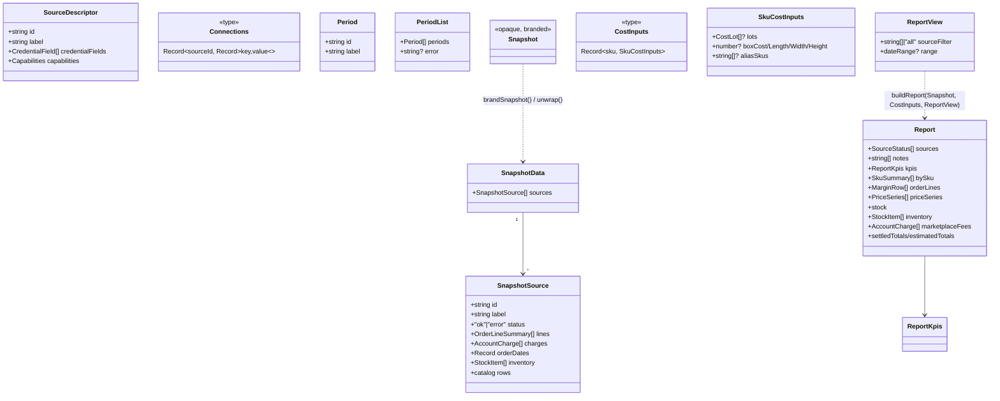

# Gateway Contract

> [Documentation Index](../index.md) · Up: [Architecture Overview](./architecture.md) · Related: [Engine](./engine.md) · [Connectors](./connectors.md) · [Frontend](./frontend.md)

## Overview

The gateway contract is **everything the dashboard is allowed to see**. It is defined as plain, serializable TypeScript types in [`lib/gateway/contract/index.ts`](../../lib/gateway/contract/index.ts), re-exported to the dashboard through [`lib/gateway/index.ts`](../../lib/gateway/index.ts) (pure, client-safe) and [`lib/gateway/actions.ts`](../../lib/gateway/actions.ts) (`"use server"`, network-touching). Nothing under `app/` may import any other path under `lib/gateway/*` — see [Configuration & Security](./configuration-and-security.md#the-gateway-import-boundary) for how that's enforced.

This design is recorded at length in [`docs/multi-marketplace-plan.md`](../multi-marketplace-plan.md) ("The gateway contract" section); this page indexes the same contract by file and type so it's directly navigable from code.

## Responsibilities

- Define every type that can legally cross from server code into the dashboard's browser bundle.
- Provide exactly two network-touching entry points (`listPeriods`, `fetchSnapshot`) and one listing call (`describeSources`), all as Next.js Server Actions.
- Provide one pure entry point (`buildReport`) that turns a fetched `Snapshot` plus the user's typed costs into a finished `Report`, with no network access.
- Keep the `Snapshot` type **opaque** to callers outside the gateway, so the dashboard is structurally prevented from reaching into marketplace-shaped data.

## Where other code fits

| Module | Role |
|---|---|
| [`contract/index.ts`](../../lib/gateway/contract/index.ts) | The types themselves (this page's main subject) |
| [`actions.ts`](../../lib/gateway/actions.ts) | Server Actions that call connectors — see [Connectors](./connectors.md) |
| [`index.ts`](../../lib/gateway/index.ts) | The pure, client-safe surface — re-exports contract types plus `buildReport` and CSV helpers from [`engine/`](./engine.md) |
| [`engine/report.ts`](../../lib/gateway/engine/report.ts) | `buildReport`'s actual implementation — see [Engine](./engine.md) |

## The contract types



### `SourceDescriptor` and `Connections` — sources and credentials

```ts
interface SourceDescriptor {
  id: string;                 // opaque to the dashboard ("walmart", "demo", ...)
  label: string;               // "Walmart", shown as-is
  credentialFields: { key: string; label: string; secret: boolean; help?: string }[];
  capabilities: { settlements: boolean; recentOrders: boolean; stock: boolean; listings: boolean };
}
type Connections = Record<string /* source id */, Record<string, string>>;
```

`describeSources()` (in `actions.ts`) returns one `SourceDescriptor` per registered connector (see [Connectors — the registry](./connectors.md#the-registry)). The dashboard's "Connect a source" screen is generated entirely from this array — it never hard-codes a marketplace's field names. `Connections` is what the user pastes in, held in `DashboardClient` state and passed back on every subsequent call; the gateway uses it for that one request only.

### `Period` / `PeriodList` — settlement periods

```ts
interface Period { id: string; label: string; }         // pre-formatted, no MMDDYYYY in the UI
interface PeriodList { periods: Period[]; error?: string; }
```

Returned by `listPeriods(connections)`, one `PeriodList` per source. A source that fails to list periods (bad credentials, network error) doesn't block the others — see the sequence diagram in [Architecture Overview](./architecture.md#request-flow-connecting-listing-periods-loading-data-editing-a-cost).

### The `Snapshot` brand

```ts
const SNAPSHOT_BRAND = Symbol("Snapshot");
export type Snapshot = { readonly [SNAPSHOT_BRAND]: true };
export function brandSnapshot<T extends object>(data: T): Snapshot & T { return data as Snapshot & T; }
```

`Snapshot` is structurally still plain JSON (the module doc in `contract/index.ts` is explicit about this — the gateway could move to its own HTTP service later with no redesign), but the branded type is a **compile-time-only** guard: `DashboardClient` can store a `Snapshot` and pass it to `buildReport`, but TypeScript won't let it read a field off it. Only `engine/report.ts`'s `unwrap()` function narrows it back to the real `SnapshotData` shape. This is not a runtime security boundary (nothing stops a browser from inspecting the actual JSON in devtools) — it's a boundary against *accidental* coupling: no dashboard code path can compile against a marketplace-shaped field.

### `CostInputs` / `SkuCostInputs` — what the user typed

```ts
interface CostLot { qty: number; unitCost: number; }
interface SkuCostInputs {
  lots?: CostLot[];
  boxCost?: number; boxLength?: number; boxWidth?: number; boxHeight?: number;
  aliasSkus?: string[];        // other sources' SKUs for the same physical product
}
type CostInputs = Record<string, SkuCostInputs>;   // keyed by normalizeSku(sku)
```

Held entirely in `DashboardClient` state (never sent anywhere but into `buildReport`), and never persisted — see [Frontend](./frontend.md#state-shape) for how the raw string inputs are parsed into this shape.

### `ReportView` — what the user is looking at

```ts
interface ReportView { sourceFilter: string[] | "all"; dateRange?: { start: string; end: string }; }
```

Currently only `sourceFilter` is wired up in the UI (the source filter chips above the tabs); `dateRange` is part of the contract but not yet exposed by `DashboardClient`.

### `Report` — what the dashboard renders

`Report` is the return type of `buildReport` and the only shape the dashboard's tables/tiles/chart actually consume. Every figure is pre-computed; every "unknown" is `null` (rendered `"—"`, never `$0`); every total states which SKUs/lines it covers. See [Engine — `buildReport`](./engine.md#buildreport-assembling-the-report) for how each field is produced, and [Frontend](./frontend.md) for how each field is rendered.

Two supporting types worth calling out:

- **`AccountCharge`** — a charge that belongs to no single order line (storage, subscriptions, ads, adjustments). The Walmart connector's `groupReconRows` routes every PO-less row here (except the account-level `PaymentSummary` row, which is still dropped) — WFS storage fees and refund/return adjustments not tied to an order both land under the generic `"adjustment"` kind today, since there's no live signal yet to split them apart. See [Connectors — known gaps](./connectors.md#known-gaps-and-unverified-behavior).
- **`ReportKpis`** — the five summary tiles' numbers (revenue, units, net, profit, stock value), each split into settled/estimated/uncosted counts so the tiles can show *why* a figure is partial rather than silently under-reporting.

## `describeSources` / `listPeriods` / `fetchSnapshot` — the three server actions

All three live in [`actions.ts`](../../lib/gateway/actions.ts) and are marked `"use server"`, making them public POST endpoints (see [Configuration & Security](./configuration-and-security.md#server-actions-are-public-endpoints)).

| Action | Touches network? | Needs credentials? | Called when |
|---|---|---|---|
| `describeSources()` | No | No | On the dashboard page's initial server render |
| `listPeriods(connections)` | Yes, per source | Yes | After "See what's available" on the connect screen |
| `fetchSnapshot(connections, periods)` | Yes, per source, in parallel | Yes | After "Load data" on the periods screen |

`fetchSnapshot` is "the expensive call" (per the plan doc): it authenticates once per source, fetches settled + recent + stock + listings in parallel via `MarketplaceConnector.snapshot()` (see [Connectors](./connectors.md#the-marketplaceconnector-base-class)), and returns a `brandSnapshot`-wrapped `SnapshotData`. A source that throws is caught and turned into a `status: "error"` entry rather than failing the whole call — every other connected source still populates.

## `buildReport` — the pure step

```ts
buildReport(snapshot: Snapshot, costs: CostInputs, view: ReportView): Report
```

Exported from `lib/gateway/index.ts` (no `"use server"` — it runs synchronously in the browser). Because it takes no credentials and makes no network call, `DashboardClient` calls it on **every keystroke** in a cost field and the dashboard still recomputes instantly — this is the entire reason the fetch/compute split exists. See [Engine — `buildReport`](./engine.md#buildreport-assembling-the-report) for its internals.

## Related documentation

- [Architecture Overview](./architecture.md) — where this contract sits between the frontend and the connectors, with the full request sequence diagram
- [Engine](./engine.md) — what `buildReport` actually computes
- [Connectors](./connectors.md) — what implements `SourceDescriptor` and produces the data a `Snapshot` wraps
- [`docs/multi-marketplace-plan.md`](../multi-marketplace-plan.md) — the original design rationale for every type here
