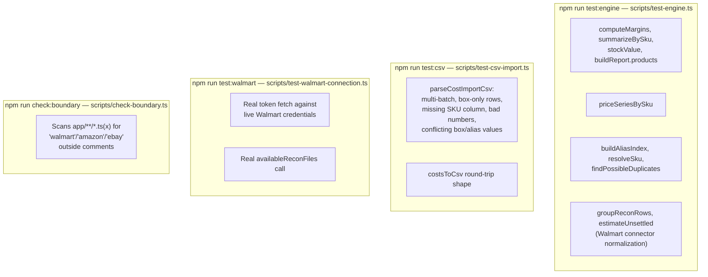
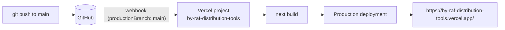

# Testing, Build & Deployment

> [Documentation Index](../index.md) · Up: [Architecture Overview](./architecture.md) · Related: [Configuration & Security](./configuration-and-security.md) · [Data Model](./data-model.md)

## Overview

There is **no test framework configured** in this repository (no Jest, Vitest, Playwright, etc. in `package.json`), and **no CI configuration** (no `.github/workflows/`, no other CI provider config found). Verification is entirely: (a) a small set of hand-written `tsx` scripts run manually, (b) TypeScript's own `strict` compiler, (c) ESLint, and (d) Vercel's automatic build-and-deploy on every push to `main`. This is a deliberate, acknowledged state — `scripts/test-csv-import.ts`'s own comment says outright: "No test framework is set up in this repo, so this follows the same plain-tsx-script convention as `test-walmart-connection.ts`."

## npm scripts

| Script | Command | What it does |
|---|---|---|
| `npm run dev` | `next dev` | Local dev server, `http://localhost:3000/margins` → redirects to `/dashboard` |
| `npm run build` | `next build` | Production build |
| `npm run start` | `next start` | Serve a production build locally |
| `npm run lint` | `eslint` | Includes the `app/**` import-boundary rule — see [Configuration & Security](./configuration-and-security.md#the-gateway-import-boundary) |
| `npm run test:walmart` | `dotenv -e .env.local -- tsx scripts/test-walmart-connection.ts` | Live connectivity check: fetches a token and lists settlement periods against real Walmart credentials in `.env.local` |
| `npm run test:csv` | `tsx scripts/test-csv-import.ts` | Fixture checks for the cost CSV import/export parser (`engine/csv.ts`) |
| `npm run test:theme` | `tsx scripts/test-theme.ts` | `parseTheme`/`resolveTheme` behaviour for the configured default and for locked (`allowSwitching: false`) mode, one design file and class-map entry per theme with identical slots, no retro `sc-*` class in modern and no daisyUI component class in retro, every retro class defined in `globals.css`, every `--color-sc-*` token overridden by the modern theme, retro-only global rules scoped to `[data-theme="retro"]` |
| `npm run test:receipts` | `tsx scripts/test-receipts.ts` | PDF header detection (incl. junk before the header), per-file and folder size limits, file-name cleanup, case-insensitive duplicate naming, SHA-256 fingerprints, zip round-trip for `app/(dashboard)/receipts/utils.ts` |
| `npm run test:portable` | `tsx scripts/test-portable.ts` | Round-trip (xlsx, zip bundle), legacy-CSV, hand-edited-workbook, merge/replace/diff, and rejection checks (bad version, zip bomb, corrupt or binary files) for `engine/portable/` |
| `npm run test:engine` | `tsx scripts/test-engine.ts` | Fixture regression check pinning the margin/price/stock engine's dollar figures |
| `npm run test:auth` | `tsx scripts/test-auth.ts` | Which auth provider each env combination selects; half-set or malformed keys fail closed — see [Authentication](./authentication.md#fails-closed) |
| `npm run check:boundary` | `tsx scripts/check-boundary.ts` | Fails if `app/` names a marketplace outside a comment — see [Configuration & Security](./configuration-and-security.md#the-gateway-import-boundary) |
| `npm run db:push` | `dotenv -e .env.local -- drizzle-kit push` | Applies the Drizzle schema to Neon — see [Data Model](./data-model.md) |
| `npm run db:studio` | `dotenv -e .env.local -- drizzle-kit studio` | Opens Drizzle Studio against Neon |

**The running dashboard needs no environment variables** (the optional auth keys turn on sign-in) (see [Configuration & Security](./configuration-and-security.md#environment-variables)).

## What each test script actually verifies

- **`test:engine`** exists specifically to prove that the gateway carve-out (moving `lib/margin.ts`/`lib/prices.ts` into `lib/gateway/engine/` — phase 1 of [`multi-marketplace-plan.md`](../multi-marketplace-plan.md)) changed **zero** dollar figures. Fixture amounts are deliberately chosen to avoid floating-point rounding surprises (`cents()` rounds every comparison to the nearest cent). This is the closest thing in the repo to a regression suite for the app's actual business logic — see [Engine — Testing](./engine.md#testing).
- **`test:csv`** is a fixture suite for `engine/csv.ts`'s import/export parser — the only area with edge-case-heavy, error-recovery logic (conflicting values, malformed rows, missing columns).
- **`test:walmart`** is a *live* connectivity check, not a fixture test — it makes a real HTTP call to Walmart using credentials from `.env.local` and is meant to be run "periodically" per the plan doc (specifically to notice the moment `availableReconFiles` stops returning an empty list for the account it was developed against).
- **`check:boundary`** is a text-level architectural-boundary check, not a functional test — see [Configuration & Security](./configuration-and-security.md#the-gateway-import-boundary) for the two other mechanisms (ESLint, `server-only`) it complements.

**None of these run automatically.** There is no pre-commit hook, no CI workflow, and no `npm test` alias wiring them together. [`docs/adding-a-marketplace.md`](../adding-a-marketplace.md) explicitly lists the commands a contributor should run by hand before considering a new connector done: `test:engine`, `test:csv`, `check:boundary`, `lint`, `build`.

## Build

`next build` is standard Next.js 16 App Router build — see [Frontend](./frontend.md) for what's actually being built, and [`AGENTS.md`](../../AGENTS.md) for the note that this Next.js version has breaking changes from older training data and that framework code should be checked against `node_modules/next/dist/docs/` before being modified.

One documented build failure mode: **"Failed to open database"** on `next build` indicates a corrupted Turbopack cache — the README's fix is deleting `.next` and rebuilding. (This is Turbopack's own build cache, unrelated to the Neon/Postgres database discussed in [Data Model](./data-model.md) — the error message is a coincidental naming collision.)

## Deployment

- **Single Vercel project**, connected to this GitHub repo with `productionBranch: main` and auto-deploy enabled — this was already configured when the project was first created, not something set up manually as part of any documented phase; it was only *discovered* (not obvious from `vercel project inspect`'s summary view, confirmed instead by matching a deployment's commit SHA to a git push) during Phase 0 provisioning per `walmart-margin-tracker-plan.md`.
- **Every push to `main` deploys to production.** There is no separate staging/preview promotion step documented or configured beyond whatever Vercel does automatically for non-production branches/PRs.
- **No `vercel.json` exists** in the repository — no custom routing, headers, or cron configuration is defined at the platform-config-file level. (The plan's Phase 7 called for a `vercel.ts` cron schedule for a daily sync job; that phase, and that file, don't exist yet — see [Data Model — the planned sync job](./data-model.md#the-planned-sync-job--not-implemented).)
- **No environment variables are required for the deployed app to function** — the optional `CLERK_*` keys turn on sign-in ([Authentication](./authentication.md#works-on-any-host)), and `WALMART_CLIENT_ID`/`WALMART_CLIENT_SECRET`/`DATABASE_URL` are only consulted by scripts a developer runs locally, never by the deployed Server Actions.

## What "done" looks like for a change in this repo

Synthesizing the above with [`docs/adding-a-marketplace.md`](../adding-a-marketplace.md)'s explicit checklist (written for connectors, but the same shape applies to most changes):

1. `npm run lint`
2. `npm run test:engine` (if `engine/` or a connector's normalization logic changed)
3. `npm run test:csv` (if `engine/csv.ts` changed)
4. `npm run check:boundary` (if anything under `app/` changed)
5. `npm run build`
6. Push to `main` → Vercel deploys automatically.

There is no automated gate enforcing this sequence — it is a documented convention, not a CI pipeline.

## Related documentation

- [Configuration & Security](./configuration-and-security.md) — the three mechanisms `check:boundary` is one of
- [Engine](./engine.md#testing) — what `test:engine` and `test:csv` actually pin
- [Data Model](./data-model.md) — `db:push`/`db:studio` and why they're unused by the running app
- [`docs/adding-a-marketplace.md`](../adding-a-marketplace.md) — the connector-specific version of this checklist
